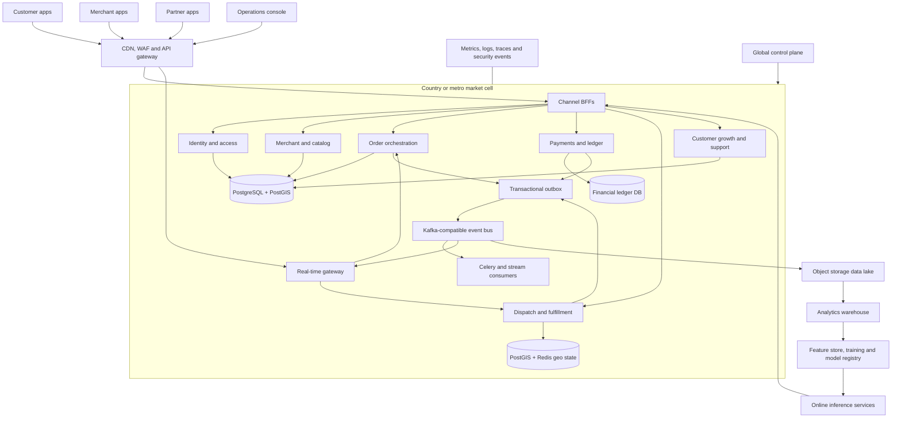
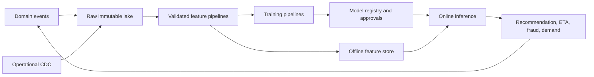

# T-Food Next-Generation Platform Blueprint

Status: Architecture baseline v1.0  
Planning horizon: 2026-2036  
Initial markets: India and Guinea  
Target scale: 10M+ customers, 100K+ merchants, 1M+ delivery partners

## 1. Executive Decision

T-Food should become a multi-vertical local-commerce operating system, not a larger restaurant application. The durable product primitives are:

1. **Market**: country, currency, language, time zone, tax policy, legal entity, payments and data-residency rules.
2. **Organization**: merchant company, branches, cloud kitchens, stores, warehouses and virtual brands.
3. **Catalog**: products, menus, variants, modifiers, inventory and channel-specific availability.
4. **Fulfillment**: on-demand, scheduled, pickup, courier, pharmacy and merchant-delivery workflows.
5. **Order**: a versioned commercial contract with immutable price, tax and policy snapshots.
6. **Supply**: delivery partners, vehicles, shifts, capacity, location and eligibility.
7. **Ledger**: customer, merchant, partner and platform money represented as double-entry postings.
8. **Event**: every important state transition published as a durable, replayable domain event.

### Architecture posture

Do **not** create 30 microservices now. For the next 6-12 months, evolve the existing Django system into a well-bounded modular monolith, add PostGIS, transactional outbox events, asynchronous workers, observability and a real-time gateway. Extract services only when one of these triggers is true:

- Independent scaling is required by measured load.
- A dedicated team owns the domain.
- Failure isolation has material business value.
- A domain requires a different storage or runtime model.
- Deployment coupling is slowing weekly delivery.

This avoids distributed-system cost before product-market fit while preserving a controlled path to global scale.

## 2. Current Baseline and Gaps

T-Food currently has a Django REST API, React marketplace, PostgreSQL 16, Redis, Gunicorn, Nginx, Docker Compose and a dispatch worker. It supports the four core roles, marketplace ordering, payment workflows, merchant operations, shared partner claiming, live coordinates, promotions, support, settlements and menu modifiers. The API suite has 80 passing tests.

The present system is a strong launch baseline but has five structural limits:

| Limit | Current effect | Required correction | Priority |
|---|---|---|---|
| Restaurant is the merchant and branch model | Cannot model chains, kitchens or virtual brands cleanly | Introduce Organization, Brand, Location and FulfillmentNode | High |
| Synchronous state changes dominate | Notifications and downstream actions can delay checkout | Transactional outbox plus asynchronous consumers | High |
| Decimal latitude/longitude queries | Dispatch cannot efficiently rank large partner fleets | PostGIS geography columns and GiST indexes | High |
| Mutable financial aggregates | Reconciliation becomes difficult across gateways and countries | Immutable double-entry ledger | High |
| Single deployment and database | One fault domain and limited regional expansion | Market cells, replicas, partitioning and gradual service extraction | Medium now, High after traction |

## 3. Target Architecture



### Cell architecture

A **market cell** contains the transactional services and data needed to keep one country or major metro operating if another region fails. India should eventually use multiple metro cells; Guinea can begin as one country cell. A global control plane distributes configuration, model versions and merchant policies but does not sit in the critical ordering path.

Why it matters: cell isolation limits blast radius, supports data residency and allows market-by-market deployments.  
Complexity: High. Introduce only after multi-region demand is real.  
Business impact: A regional incident does not stop the whole company.  
Scalability impact: Horizontal growth by adding cells instead of endlessly scaling one global database.  
Priority: Medium in year one, High from year two.

## 4. Service Boundaries and Ownership

| Domain | Responsibilities | Source of truth | First implementation | Extraction trigger |
|---|---|---|---|---|
| Identity | Accounts, sessions, MFA, devices, roles, consent | PostgreSQL | Django identity module | Multiple channels or >2K auth RPS |
| Merchant | Organizations, KYC, brands, locations, contracts | PostgreSQL | Django merchant module | Dedicated merchant platform team |
| Catalog | Products, menus, modifiers, schedules, imports | PostgreSQL + search index | Django catalog module | Catalog reads dominate API load |
| Inventory | Stock, reservations, adjustments, substitutions | PostgreSQL | Separate Django module | Grocery/pharmacy launch |
| Search | Geo-serviceability, text search, ranking | OpenSearch-compatible index | Async projection | >100K catalog items or relevance team |
| Pricing | Price books, fees, taxes, promotions, quotes | PostgreSQL + Redis cache | Pure domain library/module | Multi-country rules or high quote RPS |
| Orders | Cart validation, checkout, order state machine | PostgreSQL | Existing order module, refactored | >500 order writes/sec or team split |
| Payments | Gateway orchestration, refunds, idempotency | PostgreSQL | Existing payments module | Second gateway or financial compliance scope |
| Ledger | Double-entry postings, balances, settlements | Isolated PostgreSQL | New bounded module | Before wallets or automated payouts |
| Dispatch | Offers, matching, claiming, assignment, batching | PostGIS + Redis | Existing delivery module, upgraded | >10K active partners per metro |
| Tracking | High-frequency locations, route progress, ETA | Redis streams + time-series storage | Real-time module | >5K location updates/sec |
| Notification | Push, SMS, WhatsApp, email and preferences | PostgreSQL + event consumers | Celery workers | >1M notifications/day |
| Support | Tickets, evidence, refunds, dispute workflow | PostgreSQL + object storage | Existing support module | Dedicated CX tooling team |
| Growth | Loyalty, referrals, membership, campaigns | PostgreSQL + warehouse | Existing offers module expanded | Independent experimentation cadence |
| Ads | Sponsored inventory, bidding, attribution, billing | PostgreSQL + analytics | Build after marketplace liquidity | >10K active merchants |
| Data/AI | Event collection, features, training, inference | Lakehouse + feature store | Batch-first platform | Models affect critical decisions |

Each service owns its tables. Cross-domain writes occur through APIs or events, never direct database writes after extraction. During the modular-monolith stage, enforce the same rule through module interfaces and tests.

## 5. Event-Driven Foundation

### Required pattern

Every business transaction that must emit an event writes the domain change and an `outbox_event` row in the same PostgreSQL transaction. A relay publishes outbox records to the event bus. Consumers maintain an inbox/deduplication table keyed by event ID.

Canonical envelope:

```json
{
  "event_id": "uuidv7",
  "event_type": "order.confirmed.v1",
  "occurred_at": "ISO-8601",
  "market_id": "in-delhi",
  "aggregate_type": "order",
  "aggregate_id": "uuidv7",
  "aggregate_version": 8,
  "trace_id": "...",
  "payload": {}
}
```

Initial event topics:

- `identity.events`
- `merchant.events`
- `catalog.events`
- `inventory.events`
- `order.events`
- `payment.events`
- `ledger.events`
- `dispatch.events`
- `location.events`
- `notification.commands`
- `analytics.events`

Rules: schemas are versioned; consumers are idempotent; ordering is guaranteed per aggregate key; personally identifiable information is excluded where possible; failed messages move to a dead-letter topic with an operator replay workflow.

Why it matters: checkout no longer waits for notifications, analytics, loyalty or dispatch side effects.  
Complexity: Medium for outbox, High for a managed event platform.  
Business impact: Faster user flows and recoverable downstream failures.  
Scalability impact: Consumers scale independently and event history enables replay.  
Priority: High, immediate.

## 6. Data Architecture

### Transactional strategy

- Add `market_id` to every market-bound aggregate before international expansion.
- Use UUIDv7 externally; retain integer keys internally during migration where practical.
- Add PostGIS `geography(Point, 4326)` for locations and GiST indexes for proximity queries.
- Partition high-growth tables by market and time: location pings daily, events monthly, orders monthly after volume justifies it.
- Use PgBouncer transaction pooling before adding application replicas.
- Add read replicas for catalog, history and operations queries. Never send order decisions to an asynchronously replicated reader.
- Maintain immutable order price/tax snapshots and immutable ledger postings.
- Use optimistic aggregate versions and idempotency keys for all externally retried writes.

### Storage by workload

| Workload | Storage | Reason | Priority |
|---|---|---|---|
| Orders and catalog | PostgreSQL | Strong consistency and rich relational constraints | High |
| Proximity and service areas | PostgreSQL/PostGIS | Correct geo queries and transactional integration | High |
| Ephemeral partner presence | Redis cluster | Fast TTL, sets and geo candidate cache | High |
| Search and discovery | Search index | Text, facets, geo ranking and typo tolerance | Medium |
| Images and evidence | S3-compatible object storage + CDN | Cheap, durable and globally cacheable | High |
| Raw events | Object storage | Replayable analytics and low-cost retention | Medium |
| BI analytics | Columnar warehouse | Isolates analytical scans from checkout | Medium |
| Location history | Partitioned PostgreSQL initially, time-series store later | Volume-specific retention and compression | Medium |

### Caching rules

Cache catalog projections, restaurant cards, tax-rule lookups and serviceability shapes. Do not treat cache as the source of truth for money, inventory reservations or final assignment. Use versioned keys, bounded TTLs, request coalescing and jittered expiration to prevent stampedes.

## 7. Phase 1: Advanced Marketplace

| Recommendation | Why and business impact | Complexity | Scalability impact | Priority |
|---|---|---:|---|---|
| Organization, Brand, Location and FulfillmentNode model | Enables chains, cloud kitchens, virtual brands and stores without duplicating merchants | High | Removes restaurant-centric schema ceiling | High |
| Product and SellableVariant model | One catalog supports food, grocery, pharmacy and retail | High | Shared commerce primitive across verticals | High |
| Bulk CSV/XLSX import with validation preview | Cuts merchant onboarding from days to minutes | Medium | Async imports handle large catalogs safely | High |
| Inventory ledger and reservations | Prevents overselling and enables grocery/pharmacy | High | Partitionable by location and SKU | High |
| Modifier stock consumption | Prevents selling unavailable add-ons or sizes | Medium | Uses the same reservation engine | Medium |
| Dietary, allergen and regulatory attributes | Improves trust, search and pharmacy readiness | Medium | Metadata-driven, no vertical forks | High |
| Tax and fee rule engine | Correct country/state taxes, packaging and marketplace fees | High | Rules cached and evaluated per market | High |
| Scheduled menu availability | Breakfast menus, dayparts and campaign inventory | Medium | Precomputed availability projections | Medium |

Critical schema direction:

```text
Organization -> Brand -> Location -> FulfillmentNode
CatalogProduct -> SellableVariant -> ModifierGroup -> ModifierOption
Location + SellableVariant -> InventoryPosition
Menu -> MenuSection -> MenuListing -> AvailabilitySchedule
```

## 8. Phase 2: Real-Time Experience

Use Django Channels during the modular stage, backed by Redis, then extract a stateless real-time gateway when connection count or deployment isolation requires it. Clients subscribe to authorized channels such as `customer.order.{id}`, `merchant.location.{id}` and `partner.assignment.{id}`. The gateway consumes domain events; it does not query every service on each update.

| Capability | Implementation | Business impact | Complexity | Scale impact | Priority |
|---|---|---|---:|---|---|
| Live order stream | Event bus to WebSocket gateway with resume cursor | Removes polling and increases trust | Medium | Stateless gateways scale horizontally | High |
| Partner location stream | 3-5 second adaptive updates during delivery; slower when idle | Accurate tracking without battery waste | High | Sampling and TTL keep write volume bounded | High |
| ETA recalculation | Recompute on material route/status changes, not every ping | More credible arrival times | High | Event-triggered model controls compute cost | High |
| Push notifications | FCM/APNs with user preference and token lifecycle | Re-engages backgrounded users | Medium | Async fan-out | High |
| SMS/WhatsApp fallback | Policy-based fallback only for critical events | Reaches low-connectivity markets | Medium | Cost controls and provider abstraction | Medium |
| Prep timers and delay prediction | Merchant SLA timer plus model/rule alerts | Reduces waiting and cancellations | Medium | Async timer wheel, no request blocking | High |

SLOs: order updates p95 under 2 seconds; location fan-out p95 under 3 seconds; reconnect recovery under 5 seconds; no lost terminal order states.

## 9. Phase 3: Intelligent Dispatch

Dispatch should use a two-stage system:

1. **Candidate generation**: PostGIS and Redis presence filter partners by market, radius, vehicle, verification, capacity and active jobs.
2. **Scoring and offer policy**: rank candidates using pickup ETA, drop-off direction, reliability, fairness, earnings balance and batching opportunity.

Only the transactional assignment endpoint can claim a delivery. It uses an atomic compare-and-set/row lock and an idempotency key.

| Capability | Why and implementation | Complexity | Business impact | Scale impact | Priority |
|---|---|---:|---|---|---|
| PostGIS candidate search | Correct indexed radius and service-zone queries | Medium | Faster matching | Avoids full partner scans | High |
| Acceptance timeout and redispatch | Durable timer creates next offer wave | Medium | Fewer orphan orders | Workers shard by market | High |
| Routing provider abstraction | Start with external maps, add cached matrices and optional self-hosting later | Medium | Better ETA without vendor lock-in | Rate-limit and cost control | High |
| Capacity model | Tracks vehicle, item count, volume and active route | Medium | Enables non-food and batching | Prevents impossible assignments | High |
| Stacked/batch deliveries | Constrained insertion heuristic, then optimization solver | High | Higher partner utilization and lower delivery cost | Regional optimization workers | Medium |
| Heatmaps and positioning | Aggregate demand forecast into H3 cells | High | Less partner idle time | Precomputed tiles | Medium |
| GPS trust score | Mock-location signals, impossible speed, device integrity and route deviation | High | Reduces delivery fraud | Stream rules before ML | High |

Dispatch guardrails: never optimize solely for platform cost; enforce maximum detour, food quality windows, partner fairness, earnings floors and customer SLA.

## 10. Phase 4: AI and Machine Learning

### AI platform



Start with rules and interpretable baselines. A model enters production only with a measurable target, offline evaluation, shadow traffic, fairness review, rollback and drift monitoring.

| Model/product | Minimum data and first version | Business impact | Complexity | Priority |
|---|---|---|---:|---|
| Delivery ETA | Gradient boosting on route, merchant, weather/time and partner history | Fewer late orders and support contacts | High | High |
| Demand forecast | H3 cell x time-series forecast | Better partner positioning and merchant prep | High | High after event quality |
| Recommendations | Popularity by market, then two-tower retrieval and ranking | Higher conversion and basket size | High | Medium |
| Personalized feed | Candidate generators plus policy-aware ranking | Better retention | High | Medium |
| Fraud risk | Rules first, supervised risk score later | Lower chargeback and delivery loss | High | High |
| Churn prediction | Cohort baseline, uplift-tested interventions | Better retention spend | Medium | Medium |
| Inventory forecast | SKU/location demand quantiles | Lower waste and stock-outs | High | Medium for grocery |
| Merchant assistant | Retrieval over merchant data with tool-restricted actions | Faster catalog and operations work | Medium | Medium |
| Price optimization | Merchant opt-in recommendations, never opaque forced pricing | Improves margin and conversion | High | Low until liquidity |
| Dispatch optimization | Learning-to-rank under hard operational constraints | Lower delivery cost and lateness | Very High | Medium after deterministic engine |

AI safety: redact PII from prompts, isolate merchant data, require confirmation for financial/catalog mutations, log tool calls, evaluate hallucination and never let a generative model directly authorize refunds, payments or assignments.

## 11. Phase 5: Financial Infrastructure

Build an immutable double-entry ledger before wallets or automated payouts.

Core accounts: gateway clearing, customer receivable, merchant payable, partner payable, tax payable, promotion expense, refund liability, platform revenue and cash-on-delivery clearing.

| Capability | Why | Complexity | Business impact | Scale impact | Priority |
|---|---|---:|---|---|---|
| Double-entry ledger | Every balance is explainable and reconstructable | High | Investor-grade financial control | Append-only and partitionable | High |
| Gateway abstraction | India and Guinea require different payment rails | High | Faster regional launch | Market-specific adapters | High |
| Automated refunds | Event-driven, idempotent and reconcilable | Medium | Better trust and lower support cost | Async workers | High |
| Bank/mobile-money verification | Prevents payout fraud and failure | Medium | Enables automated settlement | Provider adapters | High |
| Automated payouts | Scheduled batches with holds and exception queues | High | Merchant/partner retention | Batch workers by market | High |
| Multi-currency money type | Store amount, currency and FX reference; never float | Medium | Cross-country correctness | Market partitioning | High |
| Tax invoices and credit notes | Versioned templates and legal sequences per entity | High | Compliance | Async document generation | High |
| Reconciliation | Match orders, ledger, gateway, bank and COD deposits | High | Detects leakage quickly | Stream plus daily controls | High |
| Wallet | Regulated stored value with limits and KYC policy | Very High | Retention and lower payment cost | Separate regulated boundary | Low until legal readiness |

## 12. Phase 6: Trust, Safety and Security

Security architecture: WAF and DDoS protection at the edge; OAuth/OIDC-compatible identity; short-lived access tokens with rotation; MFA for privileged roles; service identities with mutual TLS; secrets manager; encryption in transit and at rest; field-level protection for high-risk PII; immutable audit events; least-privilege RBAC and attribute checks by market/organization.

| Control | Why and business impact | Complexity | Scale impact | Priority |
|---|---|---:|---|---|
| Admin RBAC and approval policy | Prevents one compromised operator controlling money and identity | High | Central policy, local scope | High |
| Device and session risk | Detects account farms and takeover | High | Streaming signals | High |
| Duplicate identity detection | Protects promotions and partner onboarding | High | Graph/risk service | High |
| Payment and delivery fraud rules | Immediate protection before ML data matures | Medium | Stream processing | High |
| Immutable audit trail | Investigation, compliance and investor diligence | Medium | Append-only archive | High |
| Privacy rights workflow | Consent, export, correction and deletion/anonymization | High | Market-specific retention jobs | High |
| Security monitoring | Central SIEM, anomaly alerts and incident runbooks | High | Cross-cell visibility | High |
| Supply-chain security | Signed images, dependency scanning, SBOM and protected CI | Medium | Repeatable across services | High |

Never store raw card data. Tokenize through certified gateways. Separate production access, require just-in-time elevation and log every privileged action.

## 13. Phase 7: Super-App Ecosystem

Do not build separate vertical applications. Use configurable commerce and fulfillment primitives.

| Vertical/product | Additional domain requirements | Priority |
|---|---|---|
| Food | Prep workflow, modifiers, food-quality batching constraints | Existing |
| Grocery | Inventory, substitutions, weighted items, picking | High after core architecture |
| Courier | Package declaration, sender/receiver, proof of pickup | Medium |
| Pharmacy | Prescription workflow, pharmacist verification, restricted products | Market-dependent High |
| Retail | Variants, returns, longer fulfillment SLAs | Medium |
| Membership | Benefit rules, entitlement service and renewal billing | Medium |
| Group ordering | Shared cart, contribution deadline and payment policy | Medium |
| Scheduled/gift ordering | Reservation capacity, recipient consent and fraud policy | Medium |
| Sponsored listings | Auction/ranking separation, labels and attribution | Medium after liquidity |

The moat is a shared supply network, merchant operating system and local demand graph across verticals, not a crowded home screen.

## 14. Phase 8: Global Expansion

All market-sensitive behavior must be configuration or policy, not scattered conditionals.

`MarketConfig` owns currencies, locales, time zones, address formats, measurement units, minimum age, tax provider, payment adapters, payout schedules, support hours, data region and enabled verticals.

- India: state-aware GST invoicing, UPI/cards/COD, address landmarks, multilingual rollout and high-density metro dispatch.
- Guinea: GNF currency handling with zero-decimal display policy, mobile-money adapters, French-first localization, intermittent-connectivity UX and landmark/phone-centric addresses.
- Store timestamps in UTC and render in market/local time.
- Use ICU message catalogs, pluralization and server-provided display labels.
- Keep legal entity, invoice sequence and ledger books market-scoped.
- Deploy data in an approved region and document cross-border processing.

Complexity: High. Business impact: expansion becomes a repeatable market launch playbook. Scalability impact: cells and adapters prevent one market's rules from destabilizing another. Priority: add market primitives now; launch additional cells only with demand.

## 15. Enterprise Scalability Plan

### Capacity assumptions

Planning scenario, not a forecast:

- 10M registered users, 1M monthly active users initially at target scale.
- 100K merchants and up to 1M partner accounts, with 100K concurrently active partners at peaks.
- 1M orders/day peak horizon, roughly 12 orders/sec average and 150-300 order writes/sec at campaign peaks.
- Location updates dominate: 100K active partners at one update per 5 seconds equals 20K updates/sec.
- Read traffic can exceed 50K requests/sec due to discovery, tracking and catalog browsing.

The location path, not checkout, is likely the first extreme-scale workload. Keep it off the primary orders database.

### Bottlenecks and responses

| Bottleneck | Early signal | Solution |
|---|---|---|
| PostgreSQL connections | Queueing and connection exhaustion | PgBouncer, bounded pools, async jobs, replicas |
| Catalog query amplification | High DB CPU and N+1 traces | Projection cache, search index, CDN/BFF response caching |
| Location writes | WAL and table growth | Adaptive sampling, Redis ingestion, stream compaction, time partitions |
| Dispatch contention | Claim conflicts and slow candidate queries | Market shards, PostGIS indexes, atomic claim service |
| Notification fan-out | Checkout latency or provider throttling | Event consumers, provider queues, rate and fallback policy |
| Payment retries | Duplicate captures/refunds | Idempotency, gateway event ledger, reconciliation |
| Hot merchants/promotions | Cache and row hot spots | Key sharding, counters, reservation buckets, queue admission |
| Cross-service cascades | Timeout storms | Deadlines, circuit breakers, bulkheads and asynchronous degradation |

### Reliability targets

- Browse/search: 99.9% availability.
- Checkout/order acceptance: 99.95% availability.
- Payment and ledger integrity: no acknowledged financial event lost.
- Dispatch assignment: 99.95% with graceful manual fallback.
- RPO: under 5 minutes for transactional data; zero for committed ledger via synchronous multi-AZ storage.
- RTO: under 30 minutes per market cell; quarterly restore and failover exercises.

### Platform operations

- Kubernetes only when multiple deployable services and an SRE/platform team justify it.
- GitOps-managed environments, Helm/Kustomize templates and Terraform/OpenTofu infrastructure.
- Separate development, ephemeral preview, staging, pre-production and production accounts.
- Progressive delivery with canaries, feature flags, backward-compatible migrations and automated rollback.
- OpenTelemetry traces, RED metrics, structured logs, business KPIs and SLO-based alerts.
- Multi-AZ databases, point-in-time recovery, encrypted cross-region backups and tested restoration.
- Chaos drills for gateway outage, Redis loss, event lag, replica failure and map-provider failure.

## 16. Delivery Roadmap

### 0-12 months: Prove repeatable marketplace operations

| Quarter | Outcomes | Exit criteria |
|---|---|---|
| Q1 | Modular boundaries, market/currency primitives, outbox, Celery, object storage, CI/CD, observability | No critical side effect blocks checkout; deploys automated; SLO dashboard live |
| Q2 | Organization/branch model, catalog v2, bulk import, PostGIS, real-time order stream, push | Multi-branch merchant operates; p95 order event under 2 sec |
| Q3 | Inventory reservations, tax/fee engine, automated redispatch, prep SLA, ledger v1 | Grocery pilot possible; every delivered order reconciles to ledger |
| Q4 | Gateway adapters, automated refunds/payout pilot, ETA v1, fraud rules, privacy workflow | One city/country launch playbook is repeatable |

### 12-24 months: Multi-vertical and multi-market

- Launch grocery with substitutions and picker workflow.
- Launch courier where regulation and demand support it.
- Add search/ranking projections and recommendation baseline.
- Extract real-time tracking, notification and dispatch services based on load.
- Establish data lake, warehouse, feature pipelines and model registry.
- Introduce memberships, referrals and merchant campaign tools.
- Launch the second country through `MarketConfig` and a separate operational cell.
- Complete SOC 2/ISO 27001 readiness work appropriate to investor and enterprise needs.

### 24-36 months: Optimize network effects

- Metro-cell architecture in high-volume countries.
- Stacked delivery and constrained route optimization.
- Demand forecast, partner positioning and advanced ETA.
- Merchant AI assistant with audited tools.
- Ads platform and sponsored ranking with transparent labeling.
- Pharmacy only after legal, prescription and pharmacist workflows pass review.
- Multi-region disaster recovery and regular failover certification.
- Selective service extraction for catalog/search, orders, ledger and dispatch.

## 17. Team Plan

### Stage A: Now to first production market, 10-14 people

- CTO/Principal Architect
- 1 product lead
- 3 backend engineers
- 2 frontend/mobile engineers
- 1 product designer
- 1 QA/automation engineer
- 1 DevOps/platform engineer
- 1 data analyst
- 1 marketplace operations lead
- Part-time finance/compliance and security advisors

### Stage B: Repeatable city scale, 30-45 people

Create cross-functional squads for Consumer Growth, Merchant/Catalog, Fulfillment, Payments/Ledger and Platform. Add SRE, security, data engineering, ML engineering, fraud/risk, finance operations and country operations.

### Stage C: Multi-country scale, 80-140 people

Add country product/operations pods, a platform engineering group, dedicated trust and safety, developer productivity, data governance, ML platform, search/recommendation and ads teams. Keep service ownership aligned with on-call responsibility.

## 18. Modeled Infrastructure Cost

These are planning ranges in USD and exclude salaries, payment/SMS/map transaction fees and taxes. Actual cost depends heavily on traffic shape, cloud region, committed-use discounts, media volume and managed-service choices. Re-price before fundraising or procurement.

| Stage | Workload assumption | Monthly platform range | Main cost drivers |
|---|---|---:|---|
| Pilot | <10K MAU, <1K orders/day | $500-$2,000 | Managed DB, cache, compute, logs, backups |
| City scale | 100K MAU, 10K orders/day | $5K-$20K | Multi-AZ DB, event service, search, observability, CDN |
| Multi-city | 1M MAU, 100K orders/day | $40K-$150K | Location stream, replicas, data platform, map and messaging usage |
| Target horizon | 10M users, 1M orders/day | $250K-$1M+ | Multi-cell compute/data, 20K+ location events/sec, DR and analytics |

Cost controls: tag by market/domain; show cost per order and per active partner; sample non-error traces; tier logs; use autoscaling; cache map matrices; compress location history; purchase commitments only after stable utilization.

## 19. Revenue Architecture

1. Merchant commission by vertical, market and fulfillment type.
2. Delivery and service fees based on transparent quote rules.
3. Merchant subscription tiers for analytics, CRM, bulk operations and lower commission.
4. Customer membership for delivery benefits and partner offers.
5. Sponsored listings and merchant ads with attribution.
6. Fulfillment-as-a-service for merchants' own channels.
7. Payment and settlement services where regulation permits.
8. White-label ordering and logistics APIs for enterprise merchants.
9. Data products based on aggregated, privacy-safe market insights.

Do not depend on customer delivery fees alone. Track contribution margin per order, merchant cohort retention, partner utilization, refund/fraud loss, acquisition payback and cross-vertical frequency.

## 20. Defensible Moats

- **Local operating graph**: real preparation times, location-specific catalog, demand and courier supply.
- **Cross-vertical density**: the same partner network serves food, grocery, retail and courier demand across dayparts.
- **Merchant operating system**: catalog, inventory, promotions, fulfillment, finance and AI assistance create switching cost.
- **Dispatch intelligence**: proprietary outcomes improve ETA, batching and positioning while respecting fairness constraints.
- **Market launch engine**: country configuration, payment adapters, tax policies and cell deployment reduce expansion time.
- **Trust graph**: device, identity, payment and fulfillment signals reduce loss without punishing legitimate users.

The defensible asset is not an isolated AI model. It is the high-quality event and outcome data created by marketplace operations, plus the product loops that continuously improve that data.

## 21. Investor Readiness

An investor-grade T-Food data room should contain:

- Architecture, security and data-flow diagrams.
- Monthly SLO and incident reports.
- Restore/failover evidence.
- Unit economics by city, vertical and cohort.
- Reconciled gross merchandise value, take rate and contribution margin.
- Merchant/customer/partner retention and concentration.
- Fraud, refund, cancellation, lateness and support metrics.
- Privacy policies, processor inventory and compliance roadmap.
- Technology roadmap tied to measurable business milestones.
- IP assignment, dependency licenses, SBOM and penetration-test reports.

VC-attractive evidence is repeatable city launch, improving contribution margin, strong merchant retention, partner utilization, cross-vertical frequency and architecture that scales without a rewrite.

## 22. Immediate 90-Day Execution Plan

This is the next build sequence for the existing repository.

### Sprint 1-2: Platform safety

1. Add `Market`, `Currency` and market-aware money utilities.
2. Add transactional outbox/inbox models and a reliable relay worker.
3. Replace ad hoc background loops with Celery queues: critical, dispatch, notifications and maintenance.
4. Add OpenTelemetry correlation IDs, structured logs and core SLO metrics.
5. Add CI pipeline for lint, tests, migrations, frontend build and container scan.

### Sprint 3-4: Commerce foundation

1. Introduce Organization, Brand and Location without breaking current Restaurant APIs.
2. Add PostGIS and migrate restaurant/partner/customer points.
3. Add catalog v2 primitives and bulk import preview.
4. Add tax/fee quote snapshots to orders.

### Sprint 5-6: Real-time fulfillment

1. Publish order and delivery events through the outbox.
2. Add authenticated WebSocket subscriptions and resume cursors.
3. Add push notification tokens and provider abstraction.
4. Add durable acceptance deadlines and automatic redispatch.
5. Add dispatch SLO and live operations alerts.

### 90-day success measures

- Checkout p95 under 500 ms excluding external payment interaction.
- No notification or analytics dependency in the checkout transaction.
- 99.95% of order events delivered to consumers within 5 seconds.
- All assignment offers have a durable expiry and redispatch path.
- Every request and event is traceable by one correlation ID.
- A second market can configure currency, locale, fees and providers without code forks.

## 23. Architecture Guardrails

1. No distributed transaction across services; use local transactions, events and compensation.
2. No financial balance without immutable ledger entries.
3. No AI model in a critical path without fallback, monitoring and rollback.
4. No country-specific branch in core workflow when a policy/configuration can express it.
5. No service extraction without ownership, SLO, runbook and measured trigger.
6. No high-cardinality operational workload in the orders database without a retention/partition plan.
7. No customer-facing state transition without idempotency and audit history.
8. No new vertical that forks ordering, payment or fulfillment primitives.

This blueprint should be reviewed quarterly against actual marketplace metrics. Scale decisions must follow measured bottlenecks, while market and data boundaries must be established before growth makes them expensive to change.
