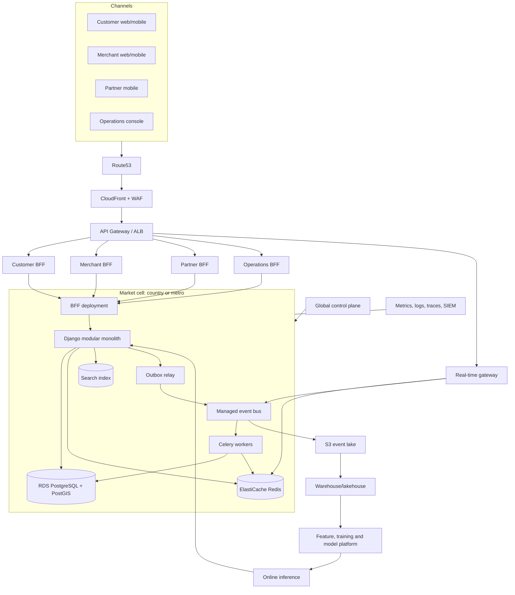
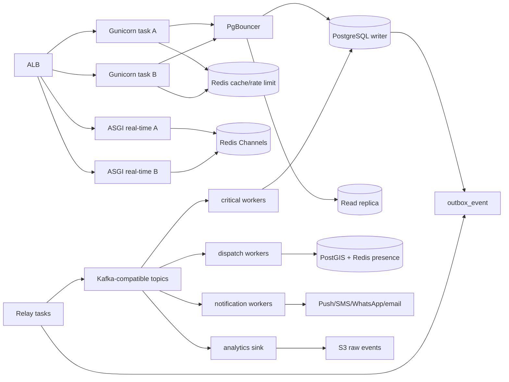
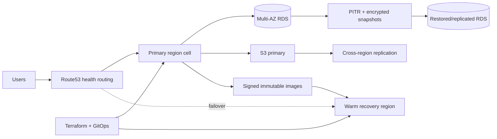

# 1. Complete System Architecture

## High-Level Architecture



## Low-Level Market Cell



## Domain Boundaries Inside the Modular Monolith

```text
identity/        users, sessions, devices, roles, consent
markets/         market, currency, locale and policy configuration
merchants/       organizations, KYC, brands, contracts and locations
catalog/         products, variants, modifiers, menus and schedules
inventory/       stock ledger, reservations and substitutions
pricing/         quotes, taxes, fees, promotions and snapshots
orders/          checkout, order aggregate and state machine
payments/        gateway orchestration, refunds and webhooks
ledger/          journals, accounts, balances and settlements
fulfillment/     delivery jobs, offers, assignment and proof
tracking/        partner presence, locations, routes and ETA
notifications/   preferences, templates and provider orchestration
growth/          loyalty, referrals, memberships and campaigns
support/         tickets, evidence, disputes and controlled refunds
trust/           devices, fraud signals, cases and audit
events/          outbox, inbox, contracts, relay and replay
```

Modules expose service functions and selectors. Views do not write across another module's models. Cross-domain reads use selectors; cross-domain effects use services or events. Add import-linter rules when modules become stable.

## Service Boundary Matrix

| Boundary | Owns | Never owns | Extraction trigger |
|---|---|---|---|
| Identity | users, devices, auth policy | merchant contracts, balances | >2K auth RPS or separate security team |
| Merchant/Catalog | organizations, locations, sellables | orders, payments | catalog dominates DB/cache and has dedicated team |
| Orders/Pricing | quote and order state | gateway credentials, partner presence | >500 order writes/sec or independent release cadence |
| Payments/Ledger | payment intent, journal, settlement | catalog, dispatch | second regulated market or finance team ownership |
| Dispatch/Tracking | offers, assignments, locations, ETA | order prices, payout truth | >10K active partners per metro |
| Notification | templates, preferences, delivery attempts | business state | >1M sends/day or provider isolation needed |
| Search/Recommendation | read projections and ranking | transaction truth | >100K active sellables or ML/search team |

## Modular Monolith Evolution

### Stage 1: Current to 12 months

- One Django codebase and transactional PostgreSQL cluster.
- Separate Django apps, module service interfaces and schema ownership.
- Transactional outbox, Celery workers and read projections.
- One deployable web image, role-specific worker processes and an ASGI real-time process.
- Feature flags and backward-compatible migrations.

### Stage 2: 12-24 months

- Extract notification, tracking and search because their scaling/storage profiles differ first.
- Keep orders, pricing, payment and ledger close until contracts and reconciliation are mature.
- Deploy one cell per country, then per high-volume metro where needed.
- Introduce managed Kafka-compatible transport only after durable event contracts are proven with Redis Streams/outbox.

### Stage 3: 24-36 months

- Extract dispatch, catalog/search, payment/ledger and order orchestration only with dedicated teams.
- Use strangler routing at the gateway: endpoint or market traffic migrates gradually.
- Dual publishing is allowed; dual writing to two authoritative databases is not.
- Backfill new service stores from immutable events plus verified snapshots.

## Microservice Extraction Checklist

No extraction proceeds until all are true:

1. Domain APIs and events are versioned and have contract tests.
2. A team owns development, on-call, data and SLOs.
3. Failure and fallback behavior is documented.
4. Data migration and reconciliation can be rerun idempotently.
5. Gateway supports canary percentage by market.
6. Distributed tracing crosses the new boundary.
7. Cost and latency improve or failure blast radius materially decreases.

## Event-Driven Architecture

- Domain write and outbox insert share one DB transaction.
- Relay publishes at least once, keyed by aggregate ID.
- Consumers use inbox uniqueness on `(consumer_name, event_id)`.
- Commands request work; events report completed facts.
- Events are immutable and versioned, with PII minimized.
- Failed messages enter retry topics and then DLQ with an operator replay flow.
- Analytics receives the same event envelope through an independent sink.

Full contracts are in [Event-Driven Platform](04-event-platform.md).

## API Gateway and BFF

### Gateway responsibilities

- TLS termination, WAF, request size limits and DDoS controls.
- JWT validation where practical, with Django performing final authorization.
- Market resolution from host/app configuration, never from an untrusted order body.
- Route versioning, quotas, request IDs and coarse rate limits.
- Canary routing by market, client version and percentage.

### Gateway exclusions

- No pricing logic, database access or order state machine.
- No long-lived business cache.
- No cross-service transaction orchestration.

### BFF responsibilities

- Customer BFF composes discovery, cart quote, order and loyalty projections.
- Merchant BFF composes catalog, inventory, orders, earnings and operations.
- Partner BFF composes offers, route, earnings and safety state.
- Operations BFF exposes audited privileged workflows.

Initially these are DRF modules/viewsets in one deployment. Extract only when channel release cadence or traffic requires it.

## Global Control Plane

The control plane stores market configuration, feature-flag definitions, event schemas, model versions and deployment metadata. Market cells cache signed configuration snapshots and keep operating when the control plane is unavailable. The control plane is never in checkout, payment or dispatch critical paths.

Configuration changes use four-eyes approval, effective dates, audit history and rollback. Secret values remain in AWS Secrets Manager, not control-plane tables.

## Market-Cell Architecture

- Cell key: country initially, metro for high-volume countries later.
- A cell owns market transaction data, Redis state, workers and operational dashboards.
- Global identity maps a user to market-local profiles; sensitive market data stays local.
- Cross-market analytics flows through de-identified events to the data platform.
- No synchronous cross-cell call is required for placing or delivering an order.

## Disaster Recovery



Targets by stage:

| Stage | RPO | RTO | Pattern |
|---|---:|---:|---|
| Pilot | 15 minutes | 4 hours | PITR plus redeploy |
| City scale | 5 minutes | 60 minutes | Multi-AZ plus warm infrastructure |
| Multi-country | <5 minutes | 30 minutes per cell | Warm region, replicated objects/config |
| Financial ledger | Near-zero committed loss | 30 minutes | Multi-AZ synchronous storage and journal reconciliation |

Quarterly restore drills must prove application startup, secrets, database integrity, object evidence and event replay, not merely that a snapshot exists.

