# 2. Database Architecture

## Aggregate and ER Model

```mermaid
erDiagram
  CURRENCY ||--o{ MARKET : defaults
  MARKET ||--o{ CUSTOMER_PROFILE : contains
  MARKET ||--o{ ORGANIZATION : registers
  MARKET ||--o{ DELIVERY_PARTNER : licenses
  MARKET ||--o{ ORDER : owns
  MARKET ||--o{ PROMOTION : scopes

  USER ||--o| CUSTOMER_PROFILE : has
  USER ||--o{ ORGANIZATION_MEMBER : joins
  USER ||--o| DELIVERY_PARTNER : operates

  ORGANIZATION ||--o{ ORGANIZATION_MEMBER : has
  ORGANIZATION ||--o{ BRAND : owns
  ORGANIZATION ||--o{ LOCATION : operates
  BRAND ||--o{ LOCATION_BRAND : appears_at
  LOCATION ||--o{ LOCATION_BRAND : hosts
  LOCATION ||--o{ FULFILLMENT_NODE : fulfills_from

  ORGANIZATION ||--o{ PRODUCT : owns
  PRODUCT ||--o{ PRODUCT_VARIANT : sells_as
  PRODUCT ||--o{ MODIFIER_GROUP : configures
  MODIFIER_GROUP ||--o{ MODIFIER_OPTION : contains
  MENU ||--o{ MENU_SECTION : contains
  MENU_SECTION ||--o{ MENU_LISTING : lists
  PRODUCT_VARIANT ||--o{ MENU_LISTING : offered_as
  MENU_LISTING ||--o{ LISTING_MODIFIER_GROUP : enables
  MODIFIER_GROUP ||--o{ LISTING_MODIFIER_GROUP : enabled_on

  FULFILLMENT_NODE ||--o{ INVENTORY_POSITION : stocks
  PRODUCT_VARIANT ||--o{ INVENTORY_POSITION : tracked_as
  INVENTORY_POSITION ||--o{ INVENTORY_MOVEMENT : changes
  INVENTORY_POSITION ||--o{ INVENTORY_RESERVATION : reserves

  CUSTOMER_PROFILE ||--o{ ORDER : places
  LOCATION ||--o{ ORDER : receives
  ORDER ||--|{ ORDER_LINE : contains
  PRODUCT_VARIANT ||--o{ ORDER_LINE : snapshots
  ORDER ||--o{ ORDER_STATUS_EVENT : records
  ORDER ||--o{ PAYMENT_INTENT : pays
  PAYMENT_INTENT ||--o{ PAYMENT_TRANSACTION : attempts
  ORDER ||--o{ DELIVERY_JOB : fulfills
  DELIVERY_JOB ||--o{ DELIVERY_OFFER : offers
  DELIVERY_PARTNER ||--o{ DELIVERY_OFFER : receives
  DELIVERY_JOB ||--o| DELIVERY_ASSIGNMENT : assigns
  DELIVERY_PARTNER ||--o{ DELIVERY_ASSIGNMENT : accepts

  PROMOTION ||--o{ PROMOTION_REDEMPTION : redeems
  CUSTOMER_PROFILE ||--o{ PROMOTION_REDEMPTION : uses
  CUSTOMER_PROFILE ||--o{ LOYALTY_ACCOUNT : owns
  LOYALTY_ACCOUNT ||--o{ LOYALTY_ENTRY : records

  LEDGER_ACCOUNT ||--o{ JOURNAL_LINE : posts
  JOURNAL_ENTRY ||--|{ JOURNAL_LINE : contains
  ORDER ||--o{ JOURNAL_ENTRY : explains
  SETTLEMENT_BATCH ||--o{ SETTLEMENT_ITEM : groups
  LEDGER_ACCOUNT ||--o{ SETTLEMENT_ITEM : settles

  MARKET ||--o{ OUTBOX_EVENT : emits
  OUTBOX_EVENT ||--o{ INBOX_EVENT : consumed_as
```



## Schema Ownership

Use Django apps as logical schemas now. When PostgreSQL permissions and service extraction become valuable, map them to physical schemas without changing aggregate ownership.

| Logical schema/app | Tables | Write owner |
|---|---|---|
| markets | currency, market, market_policy | Markets module |
| identity | user, device, consent, role binding | Identity module |
| merchants | organization, member, brand, location, node | Merchant module |
| catalog | product, variant, modifier, menu, listing | Catalog module |
| inventory | position, movement, reservation | Inventory module |
| orders | order, line, status event, quote snapshot | Orders module |
| payments | intent, transaction, webhook event, refund | Payments module |
| fulfillment | job, offer, assignment, route, proof | Fulfillment module |
| growth | promotion, redemption, loyalty account/entry | Growth module |
| ledger | account, journal entry/line, settlement | Ledger module |
| events | outbox, inbox, replay request | Events module |

No module writes another module's tables directly from views. Use a domain service in the owning module. Database foreign keys remain while the system is one database; replace cross-service FKs with immutable IDs only at extraction.

## Core Model Specifications

### Market and Currency

```text
Currency(code PK, name, symbol, decimal_places, is_active)
Market(code PK, country_code UNIQUE, name, default_currency FK,
       locale, timezone, data_region, is_active, metadata JSON)
MarketPolicy(id, market FK, policy_type, version, effective_from,
             effective_to, configuration JSON, approved_by, approved_at)
```

All market-bound unique constraints include market where globally unique identity is not required. Money is stored as `Decimal` plus a currency FK/code. Never infer historical order currency from current market settings.

### Merchant Architecture

```text
Organization(id UUIDv7, market, legal_name, display_name, type,
             tax_identifier_ciphertext, verification_status, status)
OrganizationMember(id, organization, user, role, location_scope JSON, status)
Brand(id UUIDv7, organization, name, slug, description, status)
Location(id UUIDv7, organization, address snapshot fields, point GEOGRAPHY,
         timezone, phone, status)
LocationBrand(location, brand, public_name, status)
FulfillmentNode(id UUIDv7, location, node_type, capabilities JSON,
                service_area GEOGRAPHY, prep_policy JSON, status)
```

`Organization` is the contractual merchant. `Brand` is customer-facing. `Location` is a physical site. `FulfillmentNode` is the operational source of inventory and fulfillment. A cloud kitchen is an Organization/Location with multiple Brands; a virtual brand has Brand and menu presence without requiring another physical location.

### Customer and Partner

```text
CustomerProfile(id, user UNIQUE, home_market, loyalty_status, risk_state)
CustomerAddress(id, customer, label, encrypted_address, point GEOGRAPHY,
                instructions, market, is_default)
DeliveryPartner(id UUIDv7, user UNIQUE, market, verification_status,
                availability, vehicle_type, capacity JSON, risk_state)
PartnerDevice(id, partner, device_fingerprint_hash, integrity_state, last_seen)
PartnerPresence(partner, market, state, current_jobs, heartbeat_at)
PartnerLocationEvent(partner, recorded_at, received_at, point, accuracy,
                     speed, heading, source, trust_score)
```

High-frequency PartnerLocationEvent does not remain in the primary OLTP table indefinitely. Redis holds current presence; partitioned PostgreSQL or a time-series store retains sampled history.

### Catalog and Inventory

```text
Product(id UUIDv7, organization, product_type, canonical_name,
        description, dietary_tags ARRAY/JSON, allergens ARRAY/JSON, status)
ProductVariant(id UUIDv7, product, sku, name, attributes JSON,
               base_unit, tax_category, status)
ModifierGroup(id UUIDv7, product, name, min_select, max_select, ordering)
ModifierOption(id UUIDv7, group, name, price_delta, linked_variant nullable,
               inventory_quantity_multiplier, status)
Menu(id UUIDv7, brand, location, name, channel, schedule, status)
MenuSection(id, menu, name, ordering)
MenuListing(id, section, variant, price, currency, schedule, status)
InventoryPosition(id, node, variant, on_hand, reserved, available generated/logical,
                  version, reorder_point, updated_at)
InventoryMovement(id UUIDv7, position, movement_type, quantity, reference_type,
                  reference_id, idempotency_key, occurred_at)
InventoryReservation(id UUIDv7, position, order, quantity, status, expires_at)
```

Inventory truth is the append-only movement ledger plus reservation records. `InventoryPosition` is a locked/materialized balance for fast checks. All reservation and release operations require idempotency keys.

### Order and Pricing Snapshots

```text
Order(id, public_id UUIDv7, market, currency, customer, organization,
      location, fulfillment_node, vertical, fulfillment_type, status,
      client_order_id, subtotal, discount, tax, packaging_fee,
      platform_fee, delivery_fee, tip, total, quote_version,
      delivery address/contact snapshots, created_at, updated_at)
OrderLine(id, order, product_variant_id snapshot/ref, name_snapshot,
          sku_snapshot, quantity, base_unit_price, option_total,
          tax_total, discount_total, final_unit_price,
          selected_options JSON, metadata JSON)
OrderCharge(id, order, charge_type, jurisdiction, rate, taxable_base,
            amount, currency, rule_id, rule_version, metadata)
OrderStatusEvent(id, order, sequence, previous_status, status,
                 source, actor_type, actor_id, correlation_id, occurred_at)
```

Historical order display never depends on mutable catalog/tax data. Existing FoodItem FK can remain during migration, but snapshots become authoritative.

### Payments

```text
PaymentIntent(id UUIDv7, order UNIQUE, market, currency, amount,
              method, provider, status, idempotency_key, expires_at)
PaymentTransaction(id UUIDv7, intent, transaction_type,
                   provider_reference, amount, status,
                   idempotency_key, failure_code, occurred_at)
PaymentWebhookEvent(id UUIDv7, provider, provider_event_id UNIQUE,
                    payload_hash, signature_valid, status, received_at)
Refund(id UUIDv7, order, payment_intent, amount, reason,
       status, idempotency_key, approved_by, completed_at)
```

Gateway webhook payloads are encrypted or retained only as long as required. Provider event IDs and operation idempotency keys are unique.

### Promotions and Loyalty

```text
Promotion(id UUIDv7, market, sponsor_type, sponsor_id, code,
          benefit_type, rule JSON, budget, starts_at, ends_at, status)
PromotionRedemption(id UUIDv7, promotion, customer, order UNIQUE,
                    reserved_amount, final_amount, status, expires_at)
LoyaltyAccount(id UUIDv7, customer, program, status)
LoyaltyEntry(id UUIDv7, account, entry_type, points, order_id,
             idempotency_key, expires_at, occurred_at)
```

Points use an immutable entry ledger. Account balance is a derived/cached sum, not an editable field.

### Ledger and Settlement

```text
LedgerAccount(id UUIDv7, market, currency, owner_type, owner_id,
              account_type, normal_side, status)
JournalEntry(id UUIDv7, market, currency, entry_type, reference_type,
             reference_id, idempotency_key UNIQUE, status, occurred_at)
JournalLine(id, entry, account, side DEBIT/CREDIT, amount, description)
SettlementBatch(id UUIDv7, market, owner_type, currency, period_start,
                period_end, status, provider_reference)
SettlementItem(id UUIDv7, batch, owner_id, payable_account,
               gross_amount, adjustment_amount, net_amount, status)
```

Every posted JournalEntry must balance by currency. Posted entries are never updated or deleted; reversal entries correct mistakes.

### Events

```text
OutboxEvent(id UUID, topic, event_type, schema_version, aggregate_type,
            aggregate_id, aggregate_version, market, correlation_id,
            causation_id, payload JSON, status, attempts, timestamps)
InboxEvent(id, consumer_name, event_id, event_type, status, attempts,
           received_at, processed_at, last_error,
           UNIQUE(consumer_name, event_id))
ReplayRequest(id UUID, topic, event_type_filter, market, time_range,
              destination, approved_by, status, progress, timestamps)
```

## Index Strategy

- B-tree for status/time operational queues: `(market_id, status, created_at)`.
- Partial indexes for active work: orders not terminal, pending outbox, active reservations and open offers.
- GiST on geography points and polygons.
- GIN only for stable JSON/array query patterns; do not index every JSON field.
- Covering indexes for merchant order queue, customer history and payout review based on observed query plans.
- Unique idempotency constraints include owner/operation scope.
- Run `EXPLAIN (ANALYZE, BUFFERS)` against production-like data before adding speculative indexes.

## Partitioning

| Table | Trigger | Partition key | Retention |
|---|---|---|---|
| partner_location_event | >100M rows or write pressure | market + recorded_at daily/monthly | raw 7-30d, sampled 12mo |
| outbox_event | >20M rows | created_at monthly | published hot 7d, archive 90d/S3 |
| inbox_event | >20M rows | received_at monthly | consumer-specific 30-90d |
| order_status_event | >100M rows | market + occurred_at monthly | operational 24mo, archive longer |
| journal_entry/line | Regulatory/volume trigger | market + fiscal period | statutory retention, usually years |
| order | >100M rows/cell | market + created_at monthly | hot 24mo, archive projection later |

Do not partition small tables. PostgreSQL partition overhead and global uniqueness complexity are real costs.

## Sharding

1. **Now**: one PostgreSQL cluster, every row market-keyed.
2. **Country scale**: database per market cell; route by trusted market context.
3. **Large country**: metro/cell shard using stable location/cell ID. Orders never move shards after creation.
4. **Global identity**: separate mapping from global user ID to market-local profile IDs.
5. **Analytics**: combine de-identified events in the lake/warehouse, not cross-shard OLTP queries.

Avoid application-level hash sharding until a single market database cannot meet SLOs after indexing, pooling, replicas, partitioning and vertical scaling.

## Read Replicas

- Writer: checkout, assignment, inventory, payments, ledger and any read-before-write decision.
- Replica: catalog browse projections, customer history, merchant analytics, operations reports.
- Use explicit database routers/selectors, not random ORM routing.
- Provide read-your-write by pinning a user/order to writer briefly after mutations or by returning mutation results directly.
- Monitor replica lag; fail reporting reads to writer only with bounded load, never silently for bulk analytics.

## Backup and Restore

- RDS automated PITR with a retention period appropriate to stage.
- Daily encrypted snapshots and weekly/monthly retained snapshots.
- Cross-region snapshot copy for production cells.
- S3 versioning, object lock for audit/evidence buckets and cross-region replication.
- Quarterly restore to an isolated account, run migrations/checks, reconcile ledger totals and sample media/evidence.
- Backups are unusable until a timed restore proves RPO/RTO.

## Data Retention

| Data | Hot retention | Archive/delete policy |
|---|---:|---|
| Orders/invoices/ledger | Market legal requirement | Immutable archive; anonymize customer link where lawful |
| Precise partner GPS | 7-30 days raw | Downsample/aggregate, delete precise history by policy |
| Support evidence | Ticket life + legal hold | Encrypted lifecycle rules |
| Device/fraud signals | 90-365 days | Hash/tokenize and purge per policy |
| Application logs | 14-30 days searchable | Cheap archive 90-365 days; redact PII |
| Published events | 7-90 days operational | S3 archive; event-specific deletion/anonymization |
| Password reset/session data | Hours/days | Hard expiry and purge |

Privacy deletion is a workflow, not cascading deletion. It anonymizes operational references where legal obligations require transaction retention.

## Safe Migration Rules

1. Expand nullable columns or new tables first.
2. Deploy dual-read/dual-populate code.
3. Backfill in primary-key batches with resumable commands.
4. Verify counts and invariants.
5. Add constraints using low-lock techniques where supported.
6. Contract only in a later deployment.
7. Never combine a large data rewrite with application startup migration.
8. Every migration has a rollback or forward-fix runbook.

