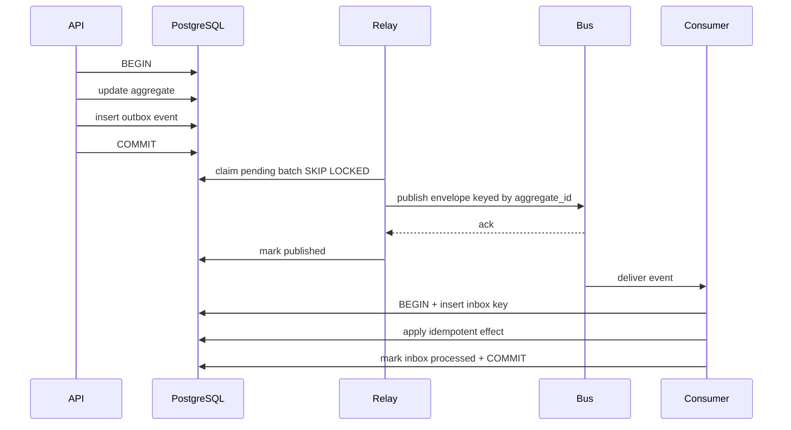

# 4. Event-Driven Platform

## Guarantees

- Transactional state plus outbox insertion are atomic.
- Transport delivery is at-least-once.
- Ordering is guaranteed only per aggregate key.
- Consumers are idempotent through InboxEvent and domain uniqueness constraints.
- Events are facts in past tense; commands are imperative requests.
- Event payloads are immutable, versioned and PII-minimized.

Exactly-once business effect comes from at-least-once delivery plus idempotent consumers, not from trusting the broker alone.

## Outbox Lifecycle



Relay crash after publish but before mark can duplicate delivery. Consumer uniqueness prevents duplicate effect.

## Naming

- Event type: `<domain>.<aggregate>.<fact>.v<major>`, for example `orders.order.created.v1`.
- Command type: `<domain>.<aggregate>.<action>.v<major>`, for example `notifications.delivery.send.v1`.
- Topic: `<environment>.<region>.<domain>.events.v1` after Kafka adoption.
- Redis bootstrap stream: `tfood:<environment>:domain-events`.
- Consumer name: `<bounded-context>.<projection-or-handler>`, for example `notifications.order-status-push`.

Do not encode tenant IDs or PII in topic names.

## Envelope

```json
{
  "event_id": "018f...uuid",
  "event_type": "orders.order.status_changed.v1",
  "schema_version": 1,
  "occurred_at": "2026-06-22T07:00:00Z",
  "producer": "orders",
  "market_id": "IN",
  "aggregate_type": "order",
  "aggregate_id": "order-public-uuid",
  "aggregate_version": 7,
  "correlation_id": "uuid",
  "causation_id": "uuid-or-null",
  "traceparent": "W3C trace context",
  "data_classification": "internal",
  "payload": {}
}
```

## Initial Event Catalog

| Event | Producer | Key payload | Initial consumers |
|---|---|---|---|
| identity.user.registered.v1 | Identity | user_id, market | analytics, notification |
| merchants.organization.verified.v1 | Merchant | organization_id, market | catalog, notification |
| catalog.listing.changed.v1 | Catalog | listing_id, location_id, version | search, cache invalidator |
| inventory.stock.changed.v1 | Inventory | node_id, variant_id, available | catalog projection, alerts |
| inventory.reservation.expired.v1 | Inventory | reservation_id, order_id | order recovery |
| orders.order.created.v1 | Orders | IDs, status, money summary | analytics, growth |
| orders.order.confirmed.v1 | Orders | order/location IDs, SLA timestamps | merchant notification, dispatch prep |
| orders.order.status_changed.v1 | Orders | previous/current, source | real-time, notifications, analytics |
| orders.order.cancelled.v1 | Orders | actor/reason/refund policy | payment, inventory, ledger |
| payments.payment.authorized.v1 | Payments | intent/order IDs, amount/currency | orders, ledger |
| payments.payment.captured.v1 | Payments | transaction reference, amount | orders, ledger, receipt |
| payments.refund.completed.v1 | Payments | refund/order, amount | ledger, notification |
| fulfillment.job.ready.v1 | Fulfillment | job/node/order, constraints | dispatch |
| fulfillment.offer.created.v1 | Dispatch | offer/partner/expiry | partner real-time/push |
| fulfillment.offer.expired.v1 | Dispatch | offer/job/wave | redispatch |
| fulfillment.assignment.created.v1 | Dispatch | job/partner/route | tracking, customer real-time |
| fulfillment.delivery.completed.v1 | Fulfillment | proof metadata, timestamps | order, ledger, loyalty |
| ledger.journal.posted.v1 | Ledger | journal/reference/currency | reconciliation, analytics |
| settlements.batch.completed.v1 | Ledger | batch, owner type/count/amount | statements, notification |
| trust.risk.signal_recorded.v1 | Trust | subject token, signal type/score | fraud decision |

## Contract Ownership and Versioning

- Producer owns schemas and compatibility tests.
- Additive optional fields remain the same major version.
- Renames, semantic changes or required-field changes require a new major version/event type.
- Producers dual-publish old/new major versions during migration.
- Consumers declare supported versions and alert on unknown major versions.
- Schemas live as JSON Schema or Avro/Protobuf definitions in `backend/events/schemas/` with fixtures.
- CI validates examples, compatibility and PII allow-lists.

Never repurpose an old field. Deprecate it, add the replacement and later retire the event version after consumer inventory confirms zero use.

## Retry and DLQ

| Failure | Strategy |
|---|---|
| Transient provider/network | exponential backoff with jitter, bounded attempts |
| Database serialization/deadlock | short randomized retry, preserve idempotency key |
| Invalid payload/schema | no blind retry; DLQ immediately |
| Missing dependency likely to arrive | delayed retry with bounded age |
| Authorization/business rejection | terminal failure plus operational event |
| Consumer code defect | circuit-break consumer, retain lag, deploy fix/replay |

Suggested delays: 5s, 30s, 2m, 10m, 1h. Critical financial retries have provider-specific rules and reconciliation fallback rather than unlimited retries.

DLQ records include original envelope, consumer, error class, sanitized stack, attempt count and timestamps. They never include secrets added by a handler.

## Replay

Replay is an audited operation:

1. Operator creates ReplayRequest with event/time/market filter and destination consumer.
2. System estimates event count and impact.
3. A second privileged operator approves financial or high-volume replay.
4. Events publish to a dedicated replay topic with original event ID and `replay_id` header.
5. Consumer inbox policy determines whether original processed events are skipped or a named rebuild consumer processes them.
6. Progress, errors and reconciliation are recorded.

Never delete inbox rows simply to force replay in production.

## Recovery Workflows

### Outbox backlog

- Alert on oldest pending age and pending count, not only relay process health.
- Verify DB connectivity, transport connectivity and schema errors.
- Scale relay horizontally; SKIP LOCKED prevents duplicate claims before timeout.
- Reclaim stale PROCESSING records after visibility timeout.
- Do not bypass the outbox by manually changing business state.

### Consumer lag

- Pause nonessential consumers before critical ones compete for capacity.
- Scale partitions/worker concurrency.
- If poison event, quarantine to DLQ and continue only under approved policy.
- Reconcile projection after catch-up using source-of-truth checksums/counts.

### Event loss suspicion

- Compare aggregate status/version against event catalog projection.
- Regenerate missing events only through an audited repair command with deterministic ID.
- Verify downstream inbox and business state, not broker offsets alone.

## Observability

Metrics:

- outbox pending/processing/failed count and oldest age
- relay publish rate/error/duration
- topic partition lag
- consumer success/retry/DLQ rate
- inbox duplicate count
- end-to-end event latency by type/market
- schema rejection count

Every event carries correlation and trace context. Logs identify event ID/type/aggregate/consumer but do not log full payload by default. A trace spans originating request, outbox creation, relay and consumer work where sampling permits.

SLO: 99.95% of critical order/payment/dispatch events reach the first durable consumer within 5 seconds; no acknowledged financial event is unrecoverable.

