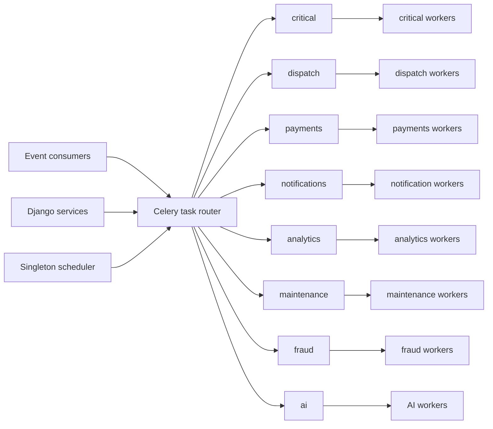

# 5. Celery Architecture

## Topology



## Queue Contracts

| Queue | Work | Concurrency posture | SLO |
|---|---|---|---|
| critical | order recovery, invariant repair, safety workflows | low prefetch, reserved capacity | start <2s |
| dispatch | offer generation, expiry, redispatch, ETA | high priority, market-sharded workers | start <1s |
| payments | capture/refund/payout/reconciliation | low concurrency, strict idempotency | provider-specific |
| notifications | push/SMS/WhatsApp/email | high concurrency, provider rate limited | critical <10s |
| analytics | event projection/export | throughput optimized | minutes |
| maintenance | expiry, cleanup, retention, backfills | low priority/time-windowed | hours |
| fraud | rule evaluation and case enrichment | low latency with fallback | <2s for inline decision |
| ai | batch inference, embeddings, forecasts | GPU/CPU specialized, budgeted | model-specific |

Do not put financial or dispatch tasks behind bulk analytics work.

## Worker Deployment

- One container image, process role selected by environment.
- Separate ECS service/Kubernetes Deployment per queue class.
- `worker_prefetch_multiplier=1` for payments/dispatch/critical.
- `acks_late=True` only for idempotent tasks.
- `task_reject_on_worker_lost=True` for recoverable tasks.
- Set hard and soft time limits per task family.
- Recycle workers by max tasks/memory where library leaks are observed.
- Scheduler is singleton with durable schedule ownership; periodic recovery queries make missed schedules harmless.

## Task Envelope and Idempotency

Task arguments contain IDs, versions and idempotency keys, not ORM objects or PII-heavy payloads.

```python
process_refund.delay(
    refund_id=str(refund.id),
    expected_version=refund.version,
    idempotency_key=f"refund:{refund.id}:execute:v1",
)
```

`TaskExecution` or domain uniqueness records `(task_name, idempotency_key, status, result_reference)`. A redelivered task returns the prior business result. Payment provider idempotency uses the same stable operation key.

## Retry Policy

- Retry only known transient exceptions.
- Exponential backoff plus jitter and maximum elapsed time.
- Validation, permission and invariant errors are terminal.
- Provider-specific `Retry-After` wins over generic delays.
- Task logs use sanitized exception classification.
- After retries, publish `tasks.task.failed.v1` and create DLQ/operations record.

Example defaults:

```text
network: 5, 30, 120, 600 seconds
database deadlock: 0.1-2 seconds, max 3
provider throttling: Retry-After, max provider policy
dispatch offer: no generic retry after expiry; recovery query advances wave
```

## Priority

Broker priorities are advisory and vary by Redis behavior. Prefer separate queues and reserved workers over relying on ten priority levels. Within dispatch, use `dispatch.urgent` and `dispatch.normal` only if measured starvation exists.

## Dead-Letter Handling

Celery/Redis does not provide a broker-native DLQ equivalent with all desired semantics. Persist terminal task failures in `FailedTask` with task name, safe arguments hash, idempotency key, queue, exception class, correlation ID, attempts and timestamps. Operations can retry through an audited endpoint that creates a new execution linked to the failed record.

Never retry by editing failure rows or replaying arbitrary serialized Python arguments.

## Scheduler

Periodic tasks:

| Frequency | Task |
|---|---|
| 5-10s | recover expired delivery offers |
| 30s | expire unpaid orders and stale presence |
| 1m | outbox/inbox/queue health gauges |
| 5m | retry eligible provider operations |
| hourly | quote/reservation cleanup, reconciliation increments |
| daily | settlements, financial reconciliation, retention and backups verification |
| weekly | aggregate maintenance and DR/synthetic reports |

Every periodic task takes a distributed lock or is independently idempotent. Prefer database advisory locks for DB-owned work; Redis locks require fencing tokens for dangerous operations.

## Redis Separation

Development may use numbered logical DBs. Production separates blast radius:

- Cache/rate-limit cluster
- Celery broker cluster
- Channels/presence cluster

Set explicit maxmemory policies. Broker data must not use an eviction mode that silently drops queued work. Monitor memory fragmentation, blocked clients, latency and replication health.

## Autoscaling

Scale on a blend of:

- queue depth
- oldest-message age
- task execution time
- CPU/memory
- provider rate-limit headroom

Dispatch and critical queues keep minimum warm capacity. Analytics/AI may scale to zero only where cold start meets SLO. Cap autoscaling to protect PostgreSQL connection limits and downstream providers.

## Monitoring and Recovery

- Flower can assist development but is not the production source of truth.
- Export Prometheus/CloudWatch metrics for task starts, success, retry, failure, duration and queue age.
- Correlate task ID, event ID, idempotency key and request correlation ID.
- Alert on oldest age and error rate by queue.
- During broker loss, transactional outbox and DB recovery scanners regenerate commands after service returns.
- During worker deployment, use graceful shutdown and enough termination grace for task limits.

## Tests

- Unit: task pure logic and exception classification.
- Transaction: idempotency and DB state with eager mode.
- Integration: real Redis broker and worker process in CI for routing/retry behavior.
- Fault: kill worker mid-task, broker restart, duplicate delivery and provider timeout.
- Capacity: verify worker concurrency cannot exceed DB/provider budgets.

