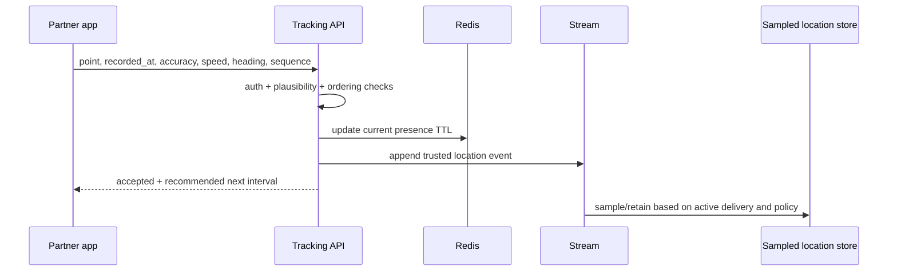

# 6. PostGIS Dispatch Engine

## Design Goals

- Find eligible nearby supply without scanning all partners.
- Expose an offer to multiple qualified partners while guaranteeing one assignment.
- Recover from lost timers, workers and client disconnects.
- Support food-quality constraints, multiple verticals and future batching.
- Detect suspicious GPS without blocking legitimate low-quality devices blindly.

## Data Model

```text
ServiceZone(id, market, name, boundary geography(MultiPolygon,4326), status)
PartnerPresence(partner PK, market, state, vehicle_type, capacity JSON,
                active_job_count, last_heartbeat_at, location_trust_score)
PartnerLocationEvent(id, partner, point geography(Point,4326),
                     recorded_at, received_at, accuracy_m, speed_mps,
                     heading, source, trust_score, flags JSON)
DeliveryJob(id UUIDv7, order, market, pickup_node, pickup_point,
            dropoff_point, vertical, requirements JSON, status,
            ready_at, pickup_deadline, delivery_deadline, version)
DeliveryOffer(id UUIDv7, job, partner, wave, score, radius_km,
              status, offered_at, expires_at, claimed_at,
              idempotency_key, reason)
DeliveryAssignment(id UUIDv7, job UNIQUE-active, partner, status,
                   assigned_at, accepted_offer, route_version)
RoutePlan(id UUIDv7, partner, status, total_distance, total_duration,
          provider, traffic_timestamp, version)
RouteStop(id, route, job, stop_type, ordering, point, service_seconds,
          earliest_at, latest_at, status)
```

PostgreSQL constraints:

- Partial unique index: one active assignment per job.
- Unique `(job_id, partner_id, wave)` offer.
- Job/offer/assignment state CHECK constraints or validated transition service.
- GiST indexes on pickup/dropoff/current partner point and service-zone boundary.
- B-tree `(market_id, status, ready_at)` and `(partner_id, status)`.

Example indexes:

```sql
CREATE INDEX location_point_gist ON merchants_location USING GIST (point);
CREATE INDEX service_zone_boundary_gist ON service_zone USING GIST (boundary);
CREATE INDEX partner_location_point_gist ON partner_location_snapshot USING GIST (point);
CREATE INDEX active_job_queue ON delivery_job (market_id, ready_at)
WHERE status IN ('READY', 'OFFERING');
CREATE UNIQUE INDEX one_active_assignment_per_job ON delivery_assignment(job_id)
WHERE status IN ('ASSIGNED', 'PICKED_UP', 'ON_THE_WAY');
```

## Location Ingestion



Update interval policy:

- Active delivery: 3-5 seconds when moving, 10-15 seconds when stationary.
- Available/no delivery: 15-60 seconds depending on demand and motion.
- Background/offline: platform-permitted significant changes/heartbeats.
- Server can return recommended interval to protect battery and infrastructure.

Reject or downgrade points that are too old, far in the future, non-monotonic by sequence, impossible relative to prior trusted point or extremely inaccurate. Do not trust client-computed speed alone.

## Redis Usage

Redis stores ephemeral acceleration:

```text
partner:presence:{market}:{partner_id} -> state/capacity/heartbeat, TTL
partners:available:{market}:{vehicle}  -> set or geospatial index
partner:location:{partner_id}          -> current trusted point, TTL
dispatch:offer:{offer_id}              -> countdown/projection, TTL
dispatch:job:{job_id}:candidates       -> bounded scored candidate cache
```

Redis GEO may generate the first candidate set for currently present partners. PostGIS verifies durable eligibility, service zones and constraints. Redis loss causes slower DB-based candidate generation, not duplicate assignment or financial loss.

## Candidate Generation

Input: job, wave radius, current time.

Hard filters:

1. Same market and enabled service zone.
2. Verified, available, current heartbeat and trusted-enough location.
3. Vehicle/capacity satisfies job requirements.
4. Active job count below policy.
5. Not blocked for merchant/customer/safety policy.
6. Pickup reachable before deadline using coarse travel estimate.
7. Partner has not declined or timed out beyond retry policy.

PostGIS query shape:

```sql
SELECT partner_id,
       ST_Distance(point, :pickup_point) AS air_distance_m
FROM partner_location_snapshot
WHERE market_id = :market
  AND last_seen_at >= :freshness_cutoff
  AND ST_DWithin(point, :pickup_point, :radius_m)
ORDER BY point <-> :pickup_point
LIMIT :candidate_limit;
```

Use geography for meter-correct distance. The KNN operator may require geometry/careful projection for best index behavior; benchmark the exact query and region.

## Scoring

Deterministic v1 score:

```text
score =
  - pickup_eta_seconds * W1
  - active_detour_seconds * W2
  + acceptance_reliability * W3
  + destination_alignment * W4
  + idle_time_fairness * W5
  + earnings_balance * W6
  - recent_offer_pressure * W7
  - risk_penalty * W8
```

Hard constraints override score. Store score components and policy version for explainability. Do not use protected attributes. Regularly audit acceptance/earnings distribution by zone and cohort.

## Offer Waves

1. Job READY creates wave 1 for a small number of closest high-score partners.
2. Offers share a 15-30 second deadline depending on market connectivity.
3. First valid atomic claim creates assignment and invalidates remaining offers.
4. If no claim, recovery scanner expires offers and expands radius/candidate count.
5. Later waves may adjust incentive within configured limits.
6. Final fallback enters operations queue or merchant/customer recovery policy.

Durable time is `DeliveryOffer.expires_at` in PostgreSQL. Celery countdown is an optimization. A periodic query always recovers `OFFERED` rows past expiry.

## Atomic Assignment

```mermaid
sequenceDiagram
  participant P1 as Partner A
  participant P2 as Partner B
  participant API
  participant DB

  par Claims
    P1->>API: claim offer A + idempotency key
    P2->>API: claim offer B + idempotency key
  end
  API->>DB: BEGIN; lock job and offer
  API->>DB: verify offered, unexpired, job unassigned
  API->>DB: insert active assignment (unique constraint)
  API->>DB: mark all other offers superseded; COMMIT
  API-->>P1: assignment or already-claimed response
  API-->>P2: assignment or already-claimed response
```

The unique active-assignment constraint is the final defense. A repeated claim with the same key returns the original result.

## Batch and Stacked Deliveries

Phase 1 uses insertion heuristics:

1. Start with partner's current route.
2. Try pickup/drop-off insertion positions.
3. Reject combinations violating capacity, promised windows, maximum detour, food-quality time or zone restrictions.
4. Estimate traffic-aware route cost using cached matrix.
5. Accept only when platform savings and all participant SLAs exceed thresholds.

Phase 2 uses an optimization service (VRP with time windows) for bounded regional batches. Solver output is a recommendation; assignment persists through the same transactional service.

Never batch pharmacy restricted goods or incompatible product classes unless explicit policy allows it.

## ETA

ETA layers:

1. Map-provider route duration and traffic.
2. Merchant prep estimate conditioned on merchant/item/time load.
3. Pickup waiting estimate.
4. Partner behavior and building/handoff estimate.
5. Uncertainty interval, not only one minute value.

Recalculate on material events: merchant delay, partner assignment, route deviation, pickup, traffic age threshold and stop completion. Do not call a map provider for every GPS ping. Cache route matrices by H3/geohash cells and time bucket with short TTL.

## GPS Fraud Resistance

Signals:

- developer/mock-location indicators and device integrity attestation
- impossible speed/teleportation against server timestamps
- repeated identical tracks across accounts/devices
- clock manipulation and stale/reordered sequence
- mismatch between GPS, IP/network region and route evidence
- pickup/drop proof far from geofence
- suspicious route completion time and collusion graph

Produce a trust score and flags. Medium-risk signals increase verification or reduce location weight; only high-confidence policy blocks work. Preserve appeal and operations review. Raw precise history follows retention policy.

## Failure Modes

| Failure | Behavior |
|---|---|
| Redis unavailable | Query PostGIS snapshots, reduce fan-out, preserve DB claims |
| Map provider unavailable | Haversine/coarse historical ETA, mark low confidence |
| Celery timer lost | periodic expiry scanner advances wave |
| Partner disconnects after claim | heartbeat grace, reassignment policy before pickup |
| DB conflict | short retry with same idempotency key |
| Location stale | exclude from automatic offer, request refresh |
| No supply | expand policy, incentive/merchant/customer communication, operations fallback |

## KPIs and SLOs

- time-to-first-offer, time-to-assignment and wave count
- acceptance, timeout and decline rates by zone
- pickup ETA error and delivery ETA error
- partner utilization, earnings/hour and fairness distribution
- unassigned order rate and manual intervention rate
- batch detour, lateness and customer rating impact
- suspicious location rate and false-positive appeal rate

Assignment p95 target: under 60 seconds in healthy supply zones. Claim correctness target: exactly one active assignment.

