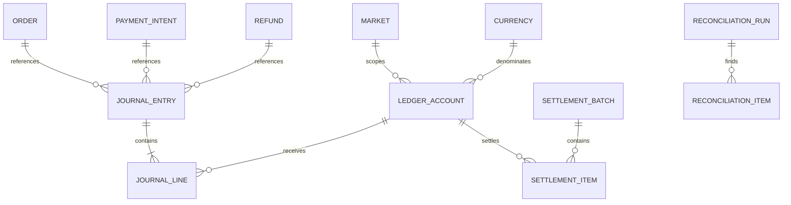
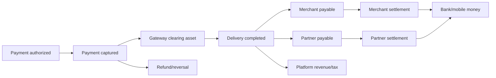

# 7. Financial Ledger System

## Principles

- Double entry: debits equal credits for every posted journal and currency.
- Append only: posted journals and lines are immutable.
- Idempotent: one business event creates one journal through a unique operation key.
- Explainable: every posting references an order, payment, refund, payout or adjustment.
- Currency isolated: no journal balances multiple currencies; FX creates explicit paired journals.
- Operational balances are projections from ledger lines, not editable totals.
- Corrections use reversal/adjustment journals with approvals.

## Schema



```text
LedgerAccount
  id UUIDv7
  market_id
  currency_code
  owner_type PLATFORM/MERCHANT/PARTNER/CUSTOMER/TAX_AUTHORITY/PROVIDER
  owner_id nullable
  account_type ASSET/LIABILITY/REVENUE/EXPENSE/EQUITY
  code
  normal_side DEBIT/CREDIT
  status
  UNIQUE(market, currency, owner_type, owner_id, code)

JournalEntry
  id UUIDv7
  market_id
  currency_code
  entry_type
  reference_type
  reference_id
  idempotency_key UNIQUE
  correlation_id
  status DRAFT/POSTED/REVERSED
  occurred_at
  posted_at
  reversal_of nullable
  metadata JSON (non-sensitive)

JournalLine
  id
  entry_id
  account_id
  side DEBIT/CREDIT
  amount Decimal(18,4 or market-safe scale)
  description
  line_reference

SettlementBatch
  id, market, currency, owner_type, period, status,
  gross, deductions, net, provider_reference, approved_by, timestamps

SettlementItem
  id, batch, owner_id, payable_account, amount, status,
  bank/mobile_money_destination_token, failure_code

ReconciliationRun
  id, market, provider, period, source_file_hash, status, counts/totals

ReconciliationItem
  id, run, external_reference, internal_reference,
  expected_amount, actual_amount, difference, status, resolution
```

Database enforcement:

- Application validates balanced entries before insert.
- Deferred constraint trigger or posting stored procedure can enforce debit=credit before POSTED status at higher maturity.
- Lines cannot update/delete when parent is POSTED.
- Unique idempotency key prevents duplicate consumer/task postings.
- Account currency must equal journal currency.

## Chart of Accounts

Per market/currency:

```text
Assets
  gateway_clearing
  bank_cash
  cod_receivable_partner
  merchant_recovery_receivable

Liabilities
  merchant_payable:{merchant}
  partner_payable:{partner}
  customer_refund_payable:{customer or pooled}
  tax_payable:{jurisdiction}
  promotion_sponsor_payable

Revenue
  platform_commission_revenue
  delivery_fee_revenue
  service_fee_revenue
  advertising_revenue
  subscription_revenue

Expenses
  partner_delivery_expense
  promotion_expense
  payment_processing_expense
  refund_goodwill_expense
```

Use subaccounts/owner dimensions rather than creating unbounded database tables. Materialize balances for statements, but rebuild them from lines.

## Order Capture Example

Example customer pays INR 600: merchant net 430, partner earning 80, platform revenue 60, tax payable 30.

```text
Debit  gateway_clearing                 600
Credit merchant_payable:merchant_1      430
Credit partner_payable:partner_9         80
Credit platform_commission_revenue       60
Credit tax_payable:IN-GST                30
```

This is illustrative; the actual posting template follows quote tax/fee ownership and recognition policy. Capture may initially credit clearing liabilities, with revenue recognized at delivery.

## Lifecycle Flows



Recognition policy is configuration approved by finance, not hard-coded ad hoc in views.

## Merchant Payouts

1. Delivery completion posts merchant payable based on frozen order economics.
2. Holds/adjustments create explicit journal entries, never overwrite payable.
3. Settlement builder selects eligible payable balance by period, legal entity and destination.
4. Four-eyes approval above market threshold.
5. Provider submission uses settlement item idempotency key.
6. Webhook/file confirms paid or failed.
7. Paid journal debits merchant payable and credits bank/gateway clearing.

Merchant statement shows order earnings, commission, taxes, refunds, adjustments, settlements and opening/closing balance.

## Partner Payouts

Partner earning is created at verified delivery completion. Incentives, tips, penalties and COD liability are separate postings. Settlement nets only legally permitted accounts. Never silently net a disputed charge.

## Refunds

- Full pre-recognition refund reverses capture/clearing entries.
- Post-delivery refund allocates loss according to approved responsibility: platform, merchant, partner or insurer.
- Partial refund uses exact amount and tax credit-note policy.
- Provider refund request and ledger posting are separate states reconciled by event.
- Duplicate webhook/task returns prior Refund result.

Example platform-funded INR 100 goodwill refund:

```text
Debit  refund_goodwill_expense          100
Credit customer_refund_payable          100

Debit  customer_refund_payable          100
Credit gateway_clearing                 100
```

## Promotions

Promotion reservation protects budget but does not post final expense until order policy says value is earned. Track sponsor:

- Platform-funded: promotion expense.
- Merchant-funded: reduce merchant payable with explicit agreement.
- Partner/provider-funded: sponsor payable/receivable.

Cancelled/expired orders release reservation idempotently. Campaign budget uses reserved + consumed amounts under row lock or partitioned budget buckets for hot campaigns.

## Wallets

Wallet is a regulated liability, not a loyalty-number shortcut.

```text
WalletAccount(customer, market, currency, status, KYC tier, limits)
WalletTransaction(id, type, amount, journal_entry, idempotency_key, status)
```

Wallet balance equals ledger liability balance. Add only after legal review, safeguarding/escrow design, KYC/AML policy and withdrawal/refund rules per country.

## COD Reconciliation

1. COD delivery posts partner cash receivable and allocates merchant/partner/platform liabilities.
2. Partner remits through bank/mobile-money/cash center.
3. Deposit file/API matches partner, route/day and amount.
4. Reconciliation clears `cod_receivable_partner`.
5. Aging limits partner availability/payout according to policy.
6. Differences create cases; no operator edits balance directly.

## Tax Accounting

- OrderCharge snapshots jurisdiction, rule/version, taxable base, rate and amount.
- Ledger posts tax liability to jurisdiction account.
- Invoice and credit-note sequence is market/legal-entity scoped.
- Merchant-as-principal versus platform-as-agent changes posting templates; configure only with tax counsel.
- Tax reports reconcile order charge snapshots to ledger liabilities and issued documents.

## Reconciliation Engine

Inputs:

- payment gateway settlements and transaction exports
- bank statements/mobile-money reports
- internal PaymentTransaction
- JournalEntry/Line
- payout provider reports
- COD deposits

Matching stages:

1. Exact provider reference and amount/currency.
2. Exact idempotency/reference with fee difference.
3. Controlled fuzzy match by date/amount/account.
4. Exception queue with reason and recommended action.

Every run stores source hash, totals and unmatched counts. Re-running the same source is idempotent.

## Financial Controls

- Separation of duties for refund approval, payout approval and account changes.
- Configurable thresholds and dual approval.
- Immutable audit events for destination, policy and manual case changes.
- Daily balance and gateway reconciliation.
- Negative balance/aging alerts.
- No raw bank credentials or card data in app DB.
- Tokenized payout destinations, encrypted high-risk PII and just-in-time finance access.
- Period close prevents backdated posting; corrections enter current period with original reference.

## Migration From Current Payout Fields

1. Create ledger schema and posting engine behind flag.
2. Backfill deterministic journals from historical terminal orders/refunds/payouts.
3. Run shadow postings for new events while current fields remain authoritative.
4. Compare merchant/partner projected balances daily.
5. Resolve all differences and freeze posting template version.
6. Switch statements to ledger projections.
7. Keep old fields read-only for one release, then remove only after audit.

Acceptance: every posted journal balances; duplicate source event has no second posting; sampled orders reconcile end-to-end; reversal preserves history.

