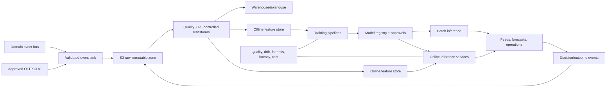

# 8. AI and Machine Learning Platform

## Operating Principle

Start with high-quality events, deterministic baselines and experiments. Do not build a feature store or deep-learning stack before reliable labels and intervention capacity exist. Each model must have an owner, target metric, fallback, cost budget, fairness review and rollback.

## Data and Model Architecture

## Data Contracts

- Events identify subject with internal token, market, timestamp and policy/model version.
- Training views are point-in-time correct to prevent future leakage.
- PII is excluded or tokenized unless specifically approved.
- Feature definitions have owner, type, freshness, source, transformation and retention.
- Predictions log model/version, feature timestamp, score, decision, fallback and eventual outcome.

## Recommendation Engine

Stages:

1. Market/location popularity with availability and serviceability filters.
2. Collaborative co-occurrence and content embeddings.
3. Two-stage retrieval plus learning-to-rank.
4. Contextual ranking by time, location, dietary policy, price range, membership and operational reliability.

Hard filters remove closed/unserviceable/unavailable/restricted inventory. Ranking cannot override compliance. Metrics: discovery CTR, menu conversion, order conversion, incremental GMV, cancellation/late-rate guardrails and diversity.

## Personalized Home Feed

Candidate sources: reorder, nearby popular, cuisines/categories, offers, new merchants, cross-vertical needs and sponsored candidates. A policy layer controls deduplication, diversity, ad labeling, fatigue and exploration. Use holdout groups and incremental-lift experiments, not click-through alone.

## ETA Prediction

Targets: prep ready time, pickup wait, travel duration and handoff duration, each with uncertainty quantiles. Features include merchant/location/item load, day/time, route, traffic age, weather where lawful, partner state, building/zone and historical errors.

Serve deterministic map/prep ETA when model is stale/unavailable. Monitor MAE and p90 absolute error by market, merchant cohort, distance and vertical. Underprediction is often more harmful than symmetric error, so evaluate calibration and late-rate.

## Demand Forecasting

Forecast orders by H3 cell, vertical and 15/30-minute bucket with quantiles. Begin with seasonal baseline plus gradient boosting; graduate to hierarchical time-series models as history grows. Outputs power partner heatmaps, staffing, merchant prep and inventory forecasts. Avoid showing false precision to partners.

## Dynamic Pricing

Use transparent, constrained pricing policy:

- inputs: supply-demand ratio, distance/time, weather/event conditions and service level
- constraints: market caps, fairness, customer disclosure, earnings floor and emergency policy
- output: fee/incentive recommendation with reason and expiry

Start in shadow mode. Dynamic fees and partner incentives are separate components. Never use sensitive/proxy attributes. Keep deterministic fallback and audit every quote policy/model version.

## Fraud Detection

Signals: device graph, account velocity, payment outcomes, promotion patterns, GPS trust, delivery evidence, collusion graph, refund behavior and destination changes.

Architecture:

1. Synchronous rules return allow/challenge/review/block under 100-200ms.
2. Async enrichment builds graph and case evidence.
3. Supervised model ranks review risk after labels mature.
4. Human outcomes feed label governance, with appeal/false-positive monitoring.

High-impact actions require deterministic policy and explanation. Generative AI does not make fraud decisions.

## Churn Prediction

Predict risk and likely intervention response separately. Features include recency/frequency, failed searches, cancellations, late orders, support issues, price sensitivity and membership state. Measure incremental retained margin through randomized treatment, not raw model AUC.

## Merchant AI Assistant

Use retrieval plus restricted tools:

- answer sales/catalog/operations questions from authorized merchant data
- draft descriptions and translations
- suggest menu availability, stock and pricing actions
- explain cancellations/delays and recommend operating changes

Tool policy:

- read tools scoped by organization/location
- draft changes are non-mutating
- explicit confirmation for catalog publication
- no autonomous bank, payout, refund or tax mutation
- prompt/response redaction, tool audit, evaluation suites and tenant isolation

## Inventory Forecasting

Forecast demand distribution by node/SKU, lead time, shelf life and substitution group. Output reorder point/range and stockout/waste risk. Merchant remains in control initially. Evaluate weighted stockout and waste cost, not forecast error alone.

## Dispatch Optimization

Sequence:

1. Deterministic candidate filters and weighted score.
2. Learning-to-rank predicts acceptance and pickup ETA.
3. Constrained optimizer selects offers/routes under fairness and SLA limits.
4. Contextual policy explores only inside safe bounds.

Store component scores and policy version. Never let a model bypass capacity, verification, service-zone or single-assignment constraints.

## Feature Store

Adopt only when multiple production models reuse features and online/offline skew is costly.

- Offline: warehouse tables keyed by entity and event time.
- Online: Redis/DynamoDB-compatible low-latency features with TTL.
- Registry: definitions in code, point-in-time materialization and validation.
- No raw mutable ORM query inside online model handlers for complex features.

## Model Registry and Deployment

Lifecycle: candidate -> validated -> shadow -> canary -> production -> retired.

Approval records data version, code commit, metrics, fairness slices, privacy review, cost, owner and rollback model. Deploy inference separately only when latency/scaling requires it; batch models remain orchestrated jobs.

Canary by market/zone/cohort. Feature flag selects model version. Shadow mode logs prediction without product effect. Rollback is one configuration change.

## Monitoring and Drift

Monitor:

- input schema, nulls, ranges and freshness
- feature distribution drift and training-serving skew
- prediction distribution and calibration
- outcome performance by market/cohort
- fairness and operational guardrails
- latency, error, fallback and cost per 1K predictions
- data/label delay and model age

Alert thresholds lead to fallback, not automatic retraining/deployment. Retraining is a controlled pipeline with approval.

## Build Order

1. Event quality, warehouse and experimentation identifiers.
2. BI baselines and deterministic recommendation/ETA.
3. Demand forecast and fraud rules.
4. Model registry/shadow deployment.
5. ETA and recommendation ML.
6. Inventory forecast and churn uplift.
7. Merchant assistant.
8. Constrained dispatch optimization and pricing only after strong governance.

