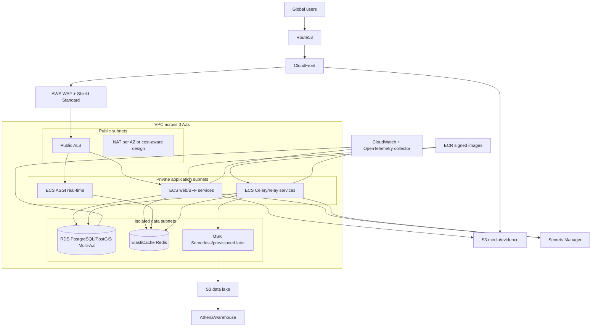
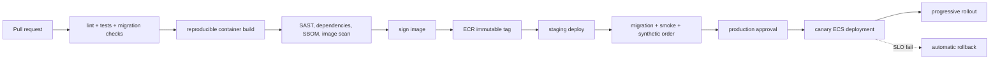

# 9. AWS and DevOps Architecture

## Compute Decision

Use **ECS Fargate first**, not EKS. T-Food currently has a handful of process roles and no platform team; ECS removes Kubernetes control-plane and cluster-operation burden. Move to EKS only when service count, specialized workloads, portability or internal platform engineering justifies it. Do not run ECS and EKS for the same ordinary workloads indefinitely.

EKS becomes reasonable when there are roughly 15+ independently deployed services, dedicated SRE/platform ownership, GPU/spot scheduling needs, advanced service mesh/policy requirements or multi-cloud constraints.

## Production AWS Architecture



## Network

- One production account per environment/security boundary; separate shared services/log archive/security accounts as maturity grows.
- VPC spans three AZs. ALB in public subnets; workloads and data in private/isolated subnets.
- Security groups reference service groups, not broad CIDRs.
- RDS/Redis have no public route.
- VPC endpoints for S3, ECR, CloudWatch and Secrets Manager reduce NAT exposure/cost.
- Egress is allow-listed/observed for payment, messaging, maps and identity providers.
- Flow logs feed security monitoring with cost-aware retention.

## Edge

- Route53 health/latency routing by market cell.
- CloudFront serves React assets, public images and signed/private evidence where authorized.
- WAF managed rules, bot/rate controls and market-specific emergency rules.
- ALB routes `/api`, `/admin` and `/ws`; admin gets stronger access controls/MFA/VPN or identity-aware proxy.
- HSTS/TLS, secure cookies and origin access control for S3.

## ECS Layout

Services/task definitions:

```text
web                 Gunicorn DRF
realtime            Daphne/Uvicorn ASGI
event-relay         outbox relay
worker-critical
worker-dispatch
worker-payments
worker-notifications
worker-maintenance
celery-beat         singleton
```

Autoscale web on requests/target response time/CPU; workers on queue age plus depth. Minimum two web tasks across AZs. Dispatch and critical keep warm capacity. Task IAM roles grant least privilege by process.

## RDS PostgreSQL/PostGIS

- Multi-AZ writer for production.
- gp3 storage with monitored IOPS/throughput; scale vertically before premature sharding.
- RDS Proxy or PgBouncer for connection pooling, selected after transaction/session behavior tests.
- Read replica for reporting/catalog when load warrants it.
- Performance Insights, slow query capture and autovacuum/partition monitoring.
- Automated PITR, encrypted snapshots, cross-region copy and tested restore.
- PostGIS extension enabled through migration/operations runbook.

## Redis

ElastiCache replication group with Multi-AZ automatic failover. Separate logical purpose at low scale; separate clusters for cache, Celery broker and Channels/presence before one workload can evict another. Encryption in transit/at rest and auth token/IAM-supported access as available.

Cache may use eviction. Celery broker must not silently evict queued tasks. Channels/presence has explicit TTLs.

## S3 and CloudFront

Buckets by data class:

- public merchant media
- private support/delivery evidence
- logs/audit archive
- raw analytics events
- backups/exports

Enable versioning, lifecycle, encryption and block public access. Use pre-signed uploads/downloads for private objects. Object Lock for regulated audit evidence where policy requires it. CloudFront invalidation is avoided through content-hashed media keys.

## Secrets and Encryption

- Secrets Manager for Django secret, DB, payment, messaging and map credentials.
- ECS task role fetches only its secrets.
- KMS keys separated for data classes/markets where required.
- Rotation runbooks and dual-key overlap for webhook secrets.
- Never place production secrets in `.env`, image layers, CI logs or Terraform state outputs.

## CI/CD



Required PR gates:

- backend formatting/lint and `python manage.py check`
- full PostgreSQL/PostGIS/Redis tests
- `makemigrations --check --dry-run`
- migration graph and forward migration on production-like schema
- frontend lint/test/build
- secret scan, SAST and dependency audit
- Docker build, SBOM and image vulnerability scan
- event schema compatibility tests

Use GitHub Actions/GitLab OIDC to assume AWS roles. No static AWS keys. Production migration runs as a one-off task before compatible app rollout; long backfills are separate resumable jobs.

## Observability

- OpenTelemetry SDK/collector for traces and context propagation.
- Structured JSON logs to CloudWatch or a managed log/search pipeline.
- Metrics: RED for services, USE for infrastructure, business/event/queue SLOs.
- Dashboards by market and domain.
- Alerts page on user impact/SLO burn, not every CPU spike.
- Trace sampling retains errors, payments, assignment conflicts and high latency at higher rates.
- Security events centralize to a log archive/SIEM.

Core SLOs:

| Capability | Availability | Latency target |
|---|---:|---:|
| browse | 99.9% | p95 <500ms API |
| checkout | 99.95% | p95 <500ms excluding gateway |
| payment/ledger | 99.95% | no acknowledged loss |
| dispatch claim | 99.95% | p95 <300ms transaction |
| real-time status | 99.9% | p95 <2s event-to-client |

## Disaster Recovery and Backup

- Multi-AZ handles instance/AZ failure.
- Warm recovery region has network, ECS definitions, secrets references and scaled-down control services.
- Cross-region RDS snapshots/replica choice follows RPO and cost stage.
- S3 cross-region replication for critical objects.
- Terraform/OpenTofu recreates infrastructure; GitOps/task definitions restore workloads.
- Quarterly game day covers regional failover, payment webhook catch-up, event replay, DNS, credentials and financial reconciliation.

## Modeled Monthly Costs

Ranges are directional USD infrastructure estimates before payment, maps, SMS/WhatsApp, taxes, support tooling and engineering. They assume managed services, sensible log retention and one primary region. Re-price in the selected AWS regions.

| Scale | Traffic model | Monthly range | Likely architecture |
|---|---|---:|---|
| 10K registered users | <1K orders/day, <500 concurrent partners | $700-$2,500 | ECS, small Multi-AZ RDS, small Redis, S3/CF, basic logs |
| 100K users | 5K-15K orders/day, 2K concurrent partners | $5K-$20K | larger RDS/replica, separated workers, search, richer observability |
| 1M users | 50K-150K orders/day, 20K concurrent partners | $40K-$180K | multi-AZ services, multiple Redis purposes, event/data platform, warm DR |
| 10M users | 0.5M-1M orders/day, 100K concurrent partners | $250K-$1.2M+ | market cells, high-rate tracking, MSK/search/warehouse, cross-region DR |

Largest variable costs may be maps/routing, outbound messaging, observability and egress rather than ordinary API compute. Track cost per completed order, per active partner-hour and per market.

## Cost Controls

- VPC endpoints and NAT design review.
- Compute Savings Plans only after stable baseline.
- Spot capacity for retryable analytics/AI, never sole critical capacity.
- Trace/log sampling and storage tiers.
- Adaptive GPS intervals and compressed/downsampled history.
- Route matrix caching and provider budget controls.
- S3 lifecycle/Parquet compression.
- Per-market/domain tags and budget alerts.
- Connection/worker caps to prevent autoscaling from overwhelming RDS/providers.

## EKS Migration Strategy

When triggers are met:

1. Build EKS platform in parallel with workload identity, ingress, autoscaling, policy and observability.
2. Migrate stateless low-risk worker first.
3. Keep RDS/Redis managed outside cluster.
4. Canary by queue/market.
5. Prove pod disruption, node/AZ failure, secrets and rollback.
6. Migrate critical services only after two stable release cycles.

