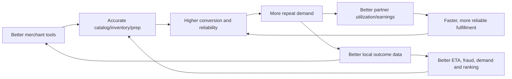

# 11. Competitive Advantages

## Scope Note

This is a strategic positioning comparison, not a claim that a competitor lacks a particular current feature. Uber Eats, DoorDash, Zomato and Swiggy continuously change products by market. T-Food should validate current competitor offerings, pricing and regulation before each launch.

## Competitive Archetypes

| Platform archetype | Demonstrated strategic strength | T-Food should learn | T-Food should avoid copying blindly |
|---|---|---|---|
| Uber Eats | global marketplace brand, logistics integration and multi-market platform discipline | market configuration, experimentation and scalable logistics APIs | entering too many markets before local density/economics |
| DoorDash | merchant logistics/commerce ecosystem and local selection depth | merchant tools, first-party fulfillment and suburban/local coverage playbooks | building enterprise breadth before core operations are reliable |
| Zomato | India restaurant discovery/food marketplace depth and strong local brand | restaurant data, customer frequency and India operating nuance | depending on discounting as the primary retention mechanism |
| Swiggy | India logistics execution and multi-vertical convenience | supply reuse, rapid commerce operations and city density | forcing all verticals into one SLA/operating model |

## T-Food Strategic Position

T-Food cannot win by reaching feature parity screen by screen. It can win in selected markets by combining:

1. A merchant operating system useful even outside T-Food orders.
2. One adaptable local-commerce catalog/order/fulfillment core across verticals.
3. A dispatch engine optimized for local constraints, fairness and intermittent connectivity.
4. A repeatable market-cell launch kit for underserved or operationally distinct markets.
5. An auditable event/financial foundation that makes AI and expansion trustworthy.

## Merchant Operating System

Build merchant value beyond demand aggregation:

- organization/branch/brand and cloud-kitchen management
- catalog, inventory, procurement signals and menu scheduling
- order operations across T-Food and merchant-owned channels
- customer CRM/loyalty with consent and channel controls
- finance statements, settlement, tax documents and reconciliation
- staff roles, operating analytics and merchant AI assistant
- fulfillment-as-a-service APIs

Moat mechanism: daily operational workflow, integrated data and reliable finance create retention that commission discounts alone cannot.

Guardrail: merchants own/export their business data. Avoid lock-in through obstruction; win through superior workflow and economics.

## Cross-Vertical Commerce

Food, grocery, pharmacy, courier and retail share Market, Organization, Location, ProductVariant, Inventory, Quote, Order, Payment and Fulfillment primitives. Each vertical adds policy/capability modules rather than a forked application.

Advantage:

- demand across breakfast/lunch/dinner, grocery peaks and courier daytime improves supply utilization
- customer frequency and membership value increase
- merchant/store onboarding reuses identity, finance and fulfillment
- one operating graph improves local availability and ETA

Guardrail: each vertical has distinct quality, capacity, regulation, returns and SLA. Shared primitives do not mean identical workflows.

## Dispatch Intelligence

Differentiation is not merely “nearest driver.” T-Food should optimize:

- pickup ETA and merchant readiness
- partner capacity and route insertion
- maximum food-quality detour
- earnings fairness and offer pressure
- zone connectivity and device/GPS trust
- cross-vertical batching compatibility
- failure recovery and manual operations visibility

Store policy versions and score components so marketplace outcomes are explainable. A fair, reliable supply experience is a long-term network advantage.

## AI Advantage

AI should compound unique operating data:

- merchant prep and stock predictions
- local H3 demand forecasts
- calibrated ETA and delay intervention
- recommendation constrained by actual availability/serviceability
- fraud graph across device/payment/delivery evidence
- merchant assistant grounded in the merchant's own authorized data
- constrained dispatch/batching optimization

The moat is the closed outcome loop and data quality, not generic access to a foundation model. Every model needs controlled experiments and deterministic fallback.

## Global Expansion Advantage

Large global platforms still require strong local execution. T-Food's proposed market cells and policy adapters make localization a first-class architecture concern:

- local currency precision, payment/mobile money and payout methods
- tax/invoice/legal-entity policy
- language, address and support conventions
- connectivity-aware apps and notification fallback
- market data residency/retention
- vertical enablement by regulation

This can be especially valuable in markets poorly served by one-size-fits-all operations. The competitive edge is faster safe localization, not merely translating UI text.

## Network Effects

Measure each edge. If merchant tools do not improve accuracy/retention or cross-vertical demand does not improve utilization/margin, the claimed network effect is not real.

## Defensible Product Bets

| Bet | Defensibility | Time horizon | Proof metric |
|---|---|---:|---|
| Merchant OS | workflow/data integration and switching value | 12-24mo | merchant retention and non-order weekly use |
| Cross-vertical supply | local density and route/partner learning | 18-36mo | orders per online hour and cross-vertical frequency |
| Market launch kit | reusable compliance/payment/ops software | 12-36mo | time/cost to launch next market |
| Dispatch/ETA graph | proprietary local outcomes | 12-36mo | assignment/ETA/late improvement |
| Trust graph | cross-domain device/payment/fulfillment outcomes | 18-36mo | fraud loss at stable false-positive rate |
| Financial platform | reconciliation and merchant confidence | 12-24mo | payout accuracy/time and exception rate |

## Where Not to Compete Yet

- nationwide coverage before dense-zone reliability
- ultra-fast delivery promises without inventory/fulfillment control
- regulated pharmacy before legal and operational readiness
- wallet/credit before licensing, KYC/AML and ledger maturity
- expensive generalized AI before event/label quality
- ad marketplace before organic demand and ranking trust

## Competitive Scorecard Per Market

Before launch and quarterly thereafter, compare by actual city/segment:

- merchant selection, exclusivity and menu/inventory accuracy
- total customer price and transparency
- ETA accuracy, completion, cancellation and support outcomes
- merchant commission, payout speed and tool value
- partner earnings/hour, utilization and safety
- membership value and cross-vertical frequency
- local language/payment/address/support quality
- contribution margin and acquisition payback

Win a small number of customer/merchant jobs decisively before broadening the promise.

